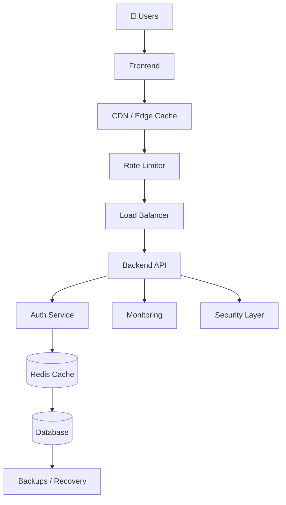

# 13 Layers of Modern Full-Stack Architecture
### A Complete Software Engineering Handbook

A production-grade educational guide covering every layer of a modern full-stack system — from the browser to disaster recovery. Built for developers at every level: beginners learning how the web works, mid-level engineers filling gaps, and seniors preparing for system design interviews.

---

## What This Covers

The same architectural layers that power **Instagram, Netflix, Stripe, Uber, and ChatGPT** — explained in depth with diagrams, code examples, real-world patterns, and production checklists.

```
User
 │
 ├── Layer 01 · Frontend          React · Next.js · SSR/CSR/SSG · State Management
 ├── Layer 02 · Backend API       REST · GraphQL · Services · Queues · WebSockets
 ├── Layer 03 · Database          PostgreSQL · Redis · S3 · ACID · Sharding
 ├── Layer 04 · Auth              JWT · OAuth · RBAC · MFA · Refresh Tokens
 ├── Layer 05 · Hosting           Docker · Blue-Green · Canary · Serverless
 ├── Layer 06 · Cloud             AWS · Kubernetes · VPC · Auto Scaling
 ├── Layer 07 · CI/CD             GitHub Actions · Terraform · Pipelines
 ├── Layer 08 · Security          OWASP · XSS · CSRF · RLS · Zero Trust
 ├── Layer 09 · Rate Limiting     Token Bucket · Redis · DDoS Protection
 ├── Layer 10 · Caching & CDN     Cloudflare · Redis · Cache Invalidation
 ├── Layer 11 · Scaling           Load Balancing · HPA · Stateless Design
 ├── Layer 12 · Monitoring        Logs · Metrics · Traces · Alerts · SLOs
 └── Layer 13 · Recovery          HA · Failover · RTO/RPO · Chaos Engineering
```

---

## Documentation

| Document | Description |
|----------|-------------|
| [Index & Global Architecture](./docs/index.md) | Master index with full system diagram and request lifecycle |
| [Layer 01 — Frontend](./docs/01-frontend/README.md) | UI rendering, state, routing, performance, security |
| [Layer 02 — Backend API](./docs/02-backend/README.md) | REST, GraphQL, middleware, jobs, WebSockets |
| [Layer 03 — Database](./docs/03-database/README.md) | SQL/NoSQL, ACID, indexing, replication, sharding |
| [Layer 04 — Auth](./docs/04-auth/README.md) | JWT, OAuth 2.0, RBAC, MFA, refresh tokens |
| [Layer 05 — Hosting](./docs/05-hosting/README.md) | Docker, deployment strategies, serverless |
| [Layer 06 — Cloud](./docs/06-cloud/README.md) | Kubernetes, VPC, regions, auto scaling |
| [Layer 07 — CI/CD](./docs/07-cicd/README.md) | GitHub Actions pipeline, Terraform, IaC |
| [Layer 08 — Security](./docs/08-security/README.md) | OWASP Top 10, SQL injection, XSS, CSRF, RLS |
| [Layer 09 — Rate Limiting](./docs/09-rate-limiting/README.md) | Token bucket, sliding window, Redis, DDoS |
| [Layer 10 — Caching & CDN](./docs/10-caching/README.md) | Browser, edge, Redis, cache invalidation |
| [Layer 11 — Scaling](./docs/11-scaling/README.md) | Load balancing, autoscaling, stateless design |
| [Layer 12 — Monitoring](./docs/12-monitoring/README.md) | Logs, metrics, traces, alerting, SLOs |
| [Layer 13 — Recovery](./docs/13-recovery/README.md) | HA, failover, RTO/RPO, chaos engineering |
| [Learning Roadmap](./docs/learning-roadmap.md) | Beginner → senior skill progression |
| [Production Architecture Examples](./docs/production-architecture-examples.md) | Social media, SaaS, AI app, e-commerce |
| [Glossary](./docs/glossary.md) | 70+ terms defined |
| [Diagrams](./docs/diagrams/README.md) | All architecture diagrams in one place |

---

## What Each Layer Contains

Every layer document is structured identically:

- **Beginner explanation** — plain English analogy before any technical content
- **Deep theoretical explanation** — how it actually works
- **Architecture diagrams** — Mermaid flowcharts and ASCII visuals
- **Code examples** — production-ready TypeScript/Python/SQL/YAML
- **Technology comparison tables** — pick the right tool for the job
- **Real-world example** — how Instagram/Netflix/Stripe uses this layer
- **Common mistakes** — what goes wrong and why
- **Best practices** — what production teams actually do
- **Interview-level Q&A** — system design and technical interview answers
- **Advanced production concepts** — patterns used at scale
- **Production checklist** — ship-ready verification list

---

## System Architecture (Overview)



---

## Who This Is For

| Role | Recommended path |
|------|-----------------|
| **Beginner** | Start with the [Learning Roadmap](./docs/learning-roadmap.md), then read layers 1 → 4 in order |
| **Mid-level** | Focus on layers 5–8 (deployment, cloud, CI/CD, security) |
| **Senior / System Design** | Deep-dive layers 6, 11, 12, 13 + [Production Architecture Examples](./docs/production-architecture-examples.md) |
| **Interview prep** | Read the "Interview-Level Insights" section in every layer |

---

## Tech Stack Referenced

`React` `Next.js` `TypeScript` `Node.js` `NestJS` `FastAPI` `PostgreSQL` `Redis` `MongoDB` `Docker` `Kubernetes` `Terraform` `GitHub Actions` `AWS` `Cloudflare` `Prometheus` `Grafana` `OpenTelemetry` `Sentry` `JWT` `OAuth 2.0`

---

## License

MIT — free to use for learning, teaching, and building courses.
