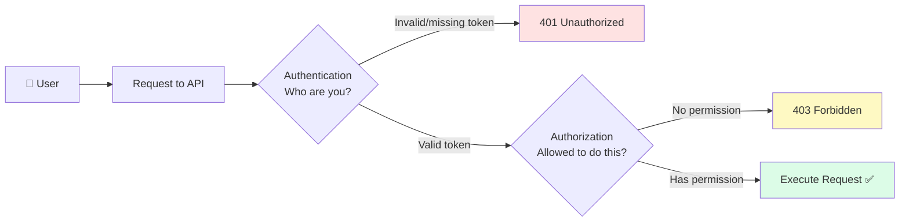
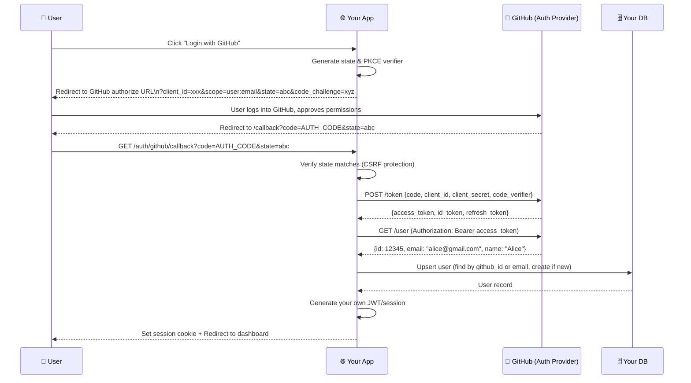
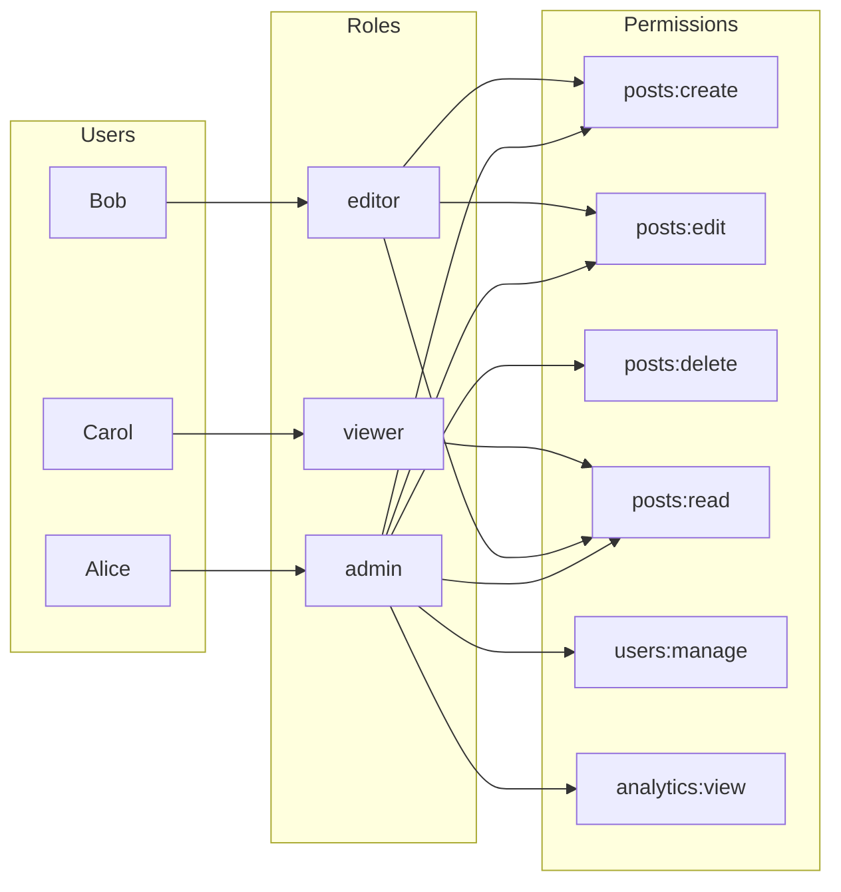
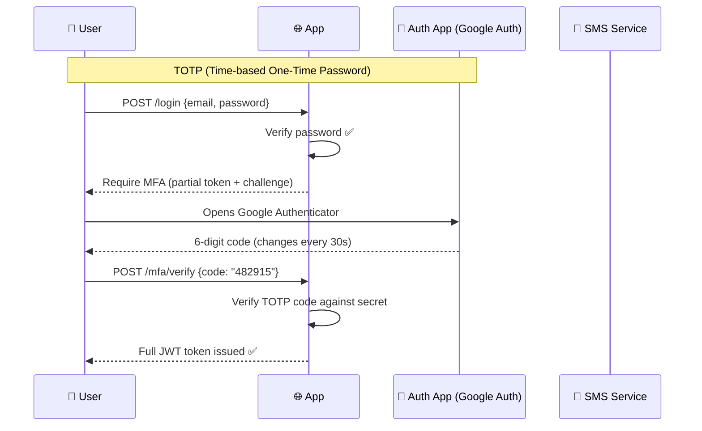
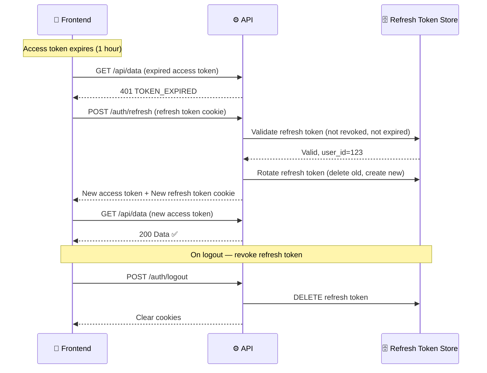
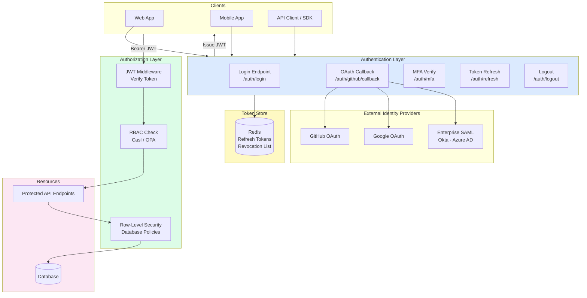

# Layer 4: Authentication & Authorization
## Identity, Access Control, and the Trust Boundary

> **Layer role:** Authentication answers "Who are you?" Authorization answers "What are you allowed to do?" Together they form the security boundary that protects every resource in your system. Getting auth wrong is the most common cause of serious security breaches.

---

## Table of Contents

1. [Beginner Explanation](#beginner-explanation)
2. [Authentication vs Authorization](#authentication-vs-authorization)
3. [JWT (JSON Web Tokens)](#jwt-json-web-tokens)
4. [Session-Based Authentication](#session-based-authentication)
5. [OAuth 2.0 & OpenID Connect](#oauth-20--openid-connect)
6. [Role-Based Access Control (RBAC)](#role-based-access-control-rbac)
7. [Attribute-Based Access Control (ABAC)](#attribute-based-access-control-abac)
8. [Multi-Factor Authentication](#multi-factor-authentication)
9. [Single Sign-On (SSO)](#single-sign-on-sso)
10. [Refresh Token Flow](#refresh-token-flow)
11. [Security Flows](#security-flows)
12. [Common Technologies](#common-technologies)
13. [Real-World Example](#real-world-example-github-auth-flow)
14. [Architecture Diagram](#architecture-diagram)
15. [Common Mistakes](#common-mistakes)
16. [Best Practices](#best-practices)
17. [Interview-Level Insights](#interview-level-insights)
18. [Advanced Production Concepts](#advanced-production-concepts)
19. [Summary](#summary)
20. [Production Checklist](#production-checklist)

---

## Beginner Explanation

Think of a hotel. Authentication is the front desk checking your ID and giving you a key card. Authorization is what doors your key card opens — your room, the gym, maybe the executive lounge if you have a premium room.

The ID check (authentication) happens once at check-in. The key card (token) is what you carry around to prove who you are. The door locks (authorization checks) verify your key card every time you try to enter a room.

In software: authentication happens when you log in (verifying your password). Your token (JWT or session cookie) is your key card. Authorization checks happen on every API request — the server reads your token and decides if you're allowed to perform the requested action.

---

## Authentication vs Authorization



| Concept | Question | HTTP Status on Failure | Example |
|---------|---------|----------------------|---------|
| **Authentication** | Who are you? | 401 Unauthorized | No token, expired token, wrong password |
| **Authorization** | What can you do? | 403 Forbidden | Logged in but no access to admin panel |

---

## JWT (JSON Web Tokens)

JWT is the most widely used authentication mechanism for stateless APIs.

### Structure

```
eyJhbGciOiJIUzI1NiIsInR5cCI6IkpXVCJ9   ← Header (base64url)
.eyJzdWIiOiJ1c2VyXzEyMyIsImVtYWlsIjoiYWxpY2VAZXhhbXBsZS5jb20iLCJyb2xlIjoiYWRtaW4iLCJpYXQiOjE3MDUzMTIwMDAsImV4cCI6MTcwNTMxNTYwMH0   ← Payload (base64url)
.SflKxwRJSMeKKF2QT4fwpMeJf36POk6yJV_adQssw5c   ← Signature (HMAC-SHA256)

Decoded Payload:
{
  "sub": "user_123",           // Subject (user ID)
  "email": "alice@example.com",
  "role": "admin",
  "iat": 1705312000,           // Issued at (Unix timestamp)
  "exp": 1705315600,           // Expires at (1 hour later)
  "jti": "unique-token-id"     // JWT ID (for revocation)
}
```

### How JWT Verification Works

```
JWT verification is STATELESS — server needs no database lookup.

1. Server receives: Header.Payload.Signature
2. Server recomputes: HMAC-SHA256(Header + "." + Payload, SECRET_KEY)
3. If computed signature == received signature → Token is valid and unmodified
4. Check exp claim → if expired → reject

The magic: The server NEVER stores tokens. It just validates the signature.
This means: infinite horizontal scaling — any server can verify any token.

The risk: If SECRET_KEY is compromised, attacker can forge any token.
→ Use RS256 (asymmetric) in high-security systems:
   Private key (backend only) signs tokens
   Public key (readable by anyone) verifies tokens
```

### Implementation

```typescript
import jwt from 'jsonwebtoken'

const JWT_SECRET = process.env.JWT_SECRET!  // 256+ bit random secret
const JWT_EXPIRES_IN = '1h'

// Generate token on login
export function generateTokens(userId: string, role: string) {
  const accessToken = jwt.sign(
    {
      sub: userId,
      role,
      type: 'access',
    },
    JWT_SECRET,
    {
      expiresIn: JWT_EXPIRES_IN,
      issuer: 'api.yourapp.com',
      audience: 'yourapp.com',
      jwtid: crypto.randomUUID(),  // Unique ID for revocation
    }
  )

  const refreshToken = jwt.sign(
    {
      sub: userId,
      type: 'refresh',
      jti: crypto.randomUUID(),
    },
    process.env.JWT_REFRESH_SECRET!,
    { expiresIn: '30d' }
  )

  return { accessToken, refreshToken }
}

// Verify token in middleware
export function verifyAccessToken(token: string): JwtPayload {
  try {
    const payload = jwt.verify(token, JWT_SECRET, {
      issuer: 'api.yourapp.com',
      audience: 'yourapp.com',
    }) as JwtPayload

    if (payload.type !== 'access') {
      throw new Error('Not an access token')
    }

    return payload
  } catch (err) {
    if (err instanceof jwt.TokenExpiredError) {
      throw new AuthError('Token expired', 'TOKEN_EXPIRED')
    }
    if (err instanceof jwt.JsonWebTokenError) {
      throw new AuthError('Invalid token', 'TOKEN_INVALID')
    }
    throw err
  }
}

// Auth middleware
export const requireAuth: RequestHandler = (req, res, next) => {
  const authHeader = req.headers.authorization
  if (!authHeader?.startsWith('Bearer ')) {
    return res.status(401).json({ error: 'No token provided' })
  }

  const token = authHeader.split(' ')[1]
  try {
    req.user = verifyAccessToken(token)
    next()
  } catch (err) {
    if (err instanceof AuthError) {
      return res.status(401).json({ error: err.message, code: err.code })
    }
    return res.status(401).json({ error: 'Invalid token' })
  }
}
```

### JWT vs Sessions Trade-off

| Dimension | JWT | Sessions |
|-----------|-----|---------|
| **Statefulness** | Stateless | Stateful (server stores session) |
| **Scalability** | Horizontal scale easy | Requires shared session store (Redis) |
| **Revocation** | Hard (must wait for exp) | Instant (delete from store) |
| **Payload** | Data in token | Session ID only (data on server) |
| **Size** | Larger (200-500 bytes) | Small cookie (~32 bytes) |
| **Best for** | APIs, microservices, mobile | Traditional web apps, SSR |

---

## Session-Based Authentication

Used by Django, Rails, and traditional web apps. The server creates a session and stores it — usually in Redis.

```mermaid
sequenceDiagram
    participant Browser
    participant Server
    participant Redis

    Browser->>Server: POST /login {email, password}
    Server->>Server: Verify password hash
    Server->>Redis: SET session:abc123 {user_id, role, created_at} TTL 86400
    Server-->>Browser: Set-Cookie: session_id=abc123; HttpOnly; Secure; SameSite=Strict

    Browser->>Server: GET /api/profile (Cookie: session_id=abc123)
    Server->>Redis: GET session:abc123
    Redis-->>Server: {user_id: 123, role: 'user'}
    Server-->>Browser: Profile data

    Browser->>Server: POST /logout
    Server->>Redis: DEL session:abc123
    Server-->>Browser: Clear-Cookie session_id
```

```typescript
import session from 'express-session'
import RedisStore from 'connect-redis'
import { createClient } from 'redis'

const redisClient = createClient({ url: process.env.REDIS_URL })
await redisClient.connect()

app.use(session({
  store: new RedisStore({ client: redisClient }),
  secret: process.env.SESSION_SECRET!,
  resave: false,
  saveUninitialized: false,
  cookie: {
    httpOnly: true,     // Cannot be accessed by JavaScript
    secure: true,       // Only sent over HTTPS
    sameSite: 'strict', // Prevent CSRF
    maxAge: 86400000,   // 1 day in milliseconds
  },
  name: '__Host-session',  // __Host- prefix adds extra security
}))

// Login handler
app.post('/login', async (req, res) => {
  const { email, password } = req.body
  const user = await userRepo.findByEmail(email)

  if (!user || !await bcrypt.compare(password, user.passwordHash)) {
    await sleep(500)  // Prevent timing attacks
    return res.status(401).json({ error: 'Invalid credentials' })
  }

  // Regenerate session ID after login (prevents session fixation)
  req.session.regenerate((err) => {
    if (err) return next(err)
    req.session.userId = user.id
    req.session.role = user.role
    res.json({ message: 'Logged in successfully' })
  })
})
```

---

## OAuth 2.0 & OpenID Connect

OAuth 2.0 enables "Login with Google/GitHub/etc." — delegating authentication to a trusted identity provider.



### Implementation with Passport.js

```typescript
import passport from 'passport'
import { Strategy as GitHubStrategy } from 'passport-github2'

passport.use(new GitHubStrategy({
  clientID: process.env.GITHUB_CLIENT_ID!,
  clientSecret: process.env.GITHUB_CLIENT_SECRET!,
  callbackURL: `${process.env.APP_URL}/auth/github/callback`,
  scope: ['user:email'],
},
async (accessToken, refreshToken, profile, done) => {
  try {
    // Find or create user in your database
    let user = await userRepo.findByProviderAccount('github', profile.id)

    if (!user) {
      // New user — create account
      user = await userRepo.create({
        email: profile.emails?.[0]?.value ?? `gh_${profile.id}@placeholder.com`,
        name: profile.displayName,
        avatarUrl: profile.photos?.[0]?.value,
        providers: [{
          provider: 'github',
          providerId: profile.id,
          accessToken,
        }],
      })
    }

    done(null, user)
  } catch (err) {
    done(err)
  }
}))

// Routes
router.get('/auth/github', passport.authenticate('github'))

router.get('/auth/github/callback',
  passport.authenticate('github', { session: false }),
  (req, res) => {
    const { accessToken, refreshToken } = generateTokens(req.user.id, req.user.role)

    // Store refresh token in httpOnly cookie
    res.cookie('refresh_token', refreshToken, {
      httpOnly: true, secure: true, sameSite: 'strict', maxAge: 30 * 24 * 60 * 60 * 1000
    })

    // Redirect frontend with access token
    res.redirect(`${process.env.FRONTEND_URL}/auth/callback?token=${accessToken}`)
  }
)
```

---

## Role-Based Access Control (RBAC)

RBAC assigns permissions to roles, and users to roles. Simpler and more predictable than ABAC.



```typescript
// RBAC implementation with Casl
import { defineAbility, AbilityBuilder } from '@casl/ability'

type Actions = 'create' | 'read' | 'update' | 'delete' | 'manage'
type Subjects = 'Post' | 'User' | 'Comment' | 'Analytics' | 'all'

export function defineAbilityFor(user: User) {
  const { can, cannot, build } = new AbilityBuilder<AppAbility>(createAbility)

  switch (user.role) {
    case 'admin':
      can('manage', 'all')  // Full access
      break

    case 'editor':
      can('create', 'Post')
      can('read', 'Post')
      can(['update', 'delete'], 'Post', { authorId: user.id })  // Own posts only
      can('read', 'Comment')
      can('delete', 'Comment')  // Can moderate comments
      break

    case 'viewer':
      can('read', 'Post', { published: true })  // Published posts only
      can('create', 'Comment')
      can(['update', 'delete'], 'Comment', { authorId: user.id })  // Own comments
      cannot('read', 'Analytics')  // Explicit deny
      break
  }

  return build()
}

// Usage in controller
const ability = defineAbilityFor(req.user)

if (!ability.can('update', 'Post')) {
  throw new ForbiddenError('Cannot update posts')
}

// With subject instance — checks field conditions
const post = await postRepo.findById(postId)
ForbiddenError.from(ability).throwUnlessCan('update', post)
```

---

## Attribute-Based Access Control (ABAC)

ABAC makes access decisions based on attributes of the user, resource, and environment. More flexible but more complex.

```
ABAC Policy Example (AWS IAM style):

Effect: Allow
Principal: users where department = "engineering"
Action: posts:update
Resource: posts where environment = "staging" OR posts where authorId = requester.id
Condition:
  - RequestTime: between 08:00 - 18:00 UTC (business hours)
  - SourceIP: within corporate IP range
  - MFAAuthenticated: true
```

```typescript
// ABAC Policy Engine
interface AbacContext {
  user: { id: string; role: string; department: string; mfaVerified: boolean }
  resource: { type: string; ownerId: string; environment: string }
  action: string
  environment: { time: Date; ip: string }
}

function evaluatePolicy(ctx: AbacContext): boolean {
  const { user, resource, action, environment } = ctx

  // Policy: engineering can update staging resources OR their own resources
  if (action === 'posts:update') {
    const isOwner = resource.ownerId === user.id
    const isEngineerOnStaging = user.department === 'engineering'
      && resource.environment === 'staging'

    return isOwner || isEngineerOnStaging
  }

  // Policy: admin actions require MFA
  if (action.startsWith('admin:')) {
    return user.role === 'admin' && user.mfaVerified
  }

  return false
}
```

---

## Multi-Factor Authentication

MFA adds a second layer of proof beyond the password.



```typescript
import speakeasy from 'speakeasy'
import QRCode from 'qrcode'

// Setup — generate secret for user
export async function setupMfa(userId: string) {
  const secret = speakeasy.generateSecret({
    name: `YourApp (${userEmail})`,
    issuer: 'YourApp',
  })

  // Store encrypted secret (not plain text!)
  await userRepo.setMfaSecret(userId, encrypt(secret.base32))

  // Return QR code for user to scan with authenticator app
  const qrCode = await QRCode.toDataURL(secret.otpauth_url!)
  return { qrCode, backupCodes: generateBackupCodes() }
}

// Verify TOTP code
export async function verifyMfaCode(userId: string, code: string): Promise<boolean> {
  const encryptedSecret = await userRepo.getMfaSecret(userId)
  const secret = decrypt(encryptedSecret)

  return speakeasy.totp.verify({
    secret,
    encoding: 'base32',
    token: code,
    window: 1,  // Allow 30s clock drift (1 window = ±30s)
  })
}

// Login flow with MFA
async function login(email: string, password: string, mfaCode?: string) {
  const user = await validateCredentials(email, password)

  if (user.mfaEnabled) {
    if (!mfaCode) {
      // Return partial token indicating MFA required
      const challengeToken = jwt.sign(
        { sub: user.id, type: 'mfa_challenge' },
        JWT_SECRET,
        { expiresIn: '5m' }
      )
      return { requiresMfa: true, challengeToken }
    }

    const valid = await verifyMfaCode(user.id, mfaCode)
    if (!valid) throw new AuthError('Invalid MFA code', 'MFA_INVALID')
  }

  return generateTokens(user.id, user.role)
}
```

---

## Refresh Token Flow

Access tokens are short-lived (15min-1hr). Refresh tokens are long-lived (days/weeks) and used to get new access tokens without re-login.



```typescript
// Refresh token rotation — security best practice
export async function refreshTokens(refreshToken: string) {
  // Verify JWT structure
  const payload = jwt.verify(refreshToken, REFRESH_SECRET) as RefreshPayload
  if (payload.type !== 'refresh') throw new AuthError('Invalid token type')

  // Check if revoked in database
  const storedToken = await tokenRepo.findByJti(payload.jti)
  if (!storedToken || storedToken.revokedAt) {
    // Suspicious: revoked token being reused
    // Might indicate refresh token theft — revoke ALL user tokens
    await tokenRepo.revokeAllUserTokens(payload.sub)
    throw new AuthError('Token reuse detected', 'TOKEN_REUSE')
  }

  // Rotate: delete old token, generate new pair
  await tokenRepo.delete(storedToken.id)
  const { accessToken, refreshToken: newRefreshToken } = generateTokens(
    payload.sub,
    storedToken.role
  )
  await tokenRepo.store(newRefreshToken.jti, payload.sub, storedToken.role)

  return { accessToken, refreshToken: newRefreshToken }
}
```

---

## Architecture Diagram



---

## Common Mistakes

### 1. Storing Passwords in Plain Text
```typescript
// ❌ Never ever
await db.user.create({ email, password })

// ❌ MD5 or SHA1 — broken, rainbow tables exist
const hash = md5(password)

// ✅ bcrypt — slow by design (prevents brute force)
// Work factor 12 = 250ms per hash (fast for login, slow for attackers)
const hash = await bcrypt.hash(password, 12)

// Verify
const valid = await bcrypt.compare(inputPassword, storedHash)
```

### 2. JWTs Without Expiration
```javascript
// ❌ Token lives forever — if stolen, attacker has permanent access
jwt.sign({ userId: '123' }, SECRET)

// ✅ Short-lived access tokens
jwt.sign({ userId: '123' }, SECRET, { expiresIn: '1h' })

// ✅ Pair with refresh token rotation for seamless UX
```

### 3. Putting Sensitive Data in JWT Payload
```javascript
// ❌ JWT payload is BASE64 ENCODED, not encrypted — anyone can read it
jwt.sign({
  userId: '123',
  creditCard: '4242424242424242',  // VISIBLE TO CLIENT!
  password: 'hunter2',             // VISIBLE TO CLIENT!
  ssn: '123-45-6789',             // VISIBLE TO CLIENT!
}, SECRET)

// ✅ Only put non-sensitive claims in JWT
jwt.sign({
  sub: userId,
  role: 'user',
  // That's it — fetch sensitive data from DB when needed
}, SECRET, { expiresIn: '1h' })
```

### 4. Not Validating OAuth State Parameter
```typescript
// ❌ No state validation — vulnerable to CSRF
app.get('/auth/github/callback', async (req, res) => {
  const { code } = req.query
  // Exchane code... (CSRF attack: attacker tricks user into binding attacker's GitHub to victim's account)
})

// ✅ Validate state to prevent CSRF
app.get('/auth/github/callback', async (req, res) => {
  const { code, state } = req.query
  const sessionState = req.session.oauthState
  if (!state || state !== sessionState) {
    return res.status(400).json({ error: 'Invalid state parameter' })
  }
  // Proceed safely...
})
```

---

## Best Practices

1. **Never roll your own crypto** — Use bcrypt for passwords, standard JWT libraries, proven OAuth flows.
2. **Implement account lockout** — Lock accounts after 5 failed login attempts for 15 minutes.
3. **Rate limit auth endpoints** — Auth endpoints are top DDoS and brute-force targets.
4. **Audit log all auth events** — Login, logout, password change, MFA enable/disable, role changes.
5. **Rotate refresh tokens** — Single-use refresh tokens prevent refresh token theft from being permanent.
6. **Validate input early** — Check email format, password strength before DB queries.
7. **Use timing-safe comparison** — `crypto.timingSafeEqual()` for secrets, prevents timing attacks.

---

## Interview-Level Insights

### Q: What's the difference between authentication and authorization?

**A:** Authentication is verifying identity — confirming you are who you claim to be (password check, biometric, certificate). Authorization is verifying permission — determining what an authenticated identity is allowed to do (RBAC, policy evaluation).

They're separate concerns and failures produce different HTTP codes: 401 (not authenticated), 403 (authenticated but not authorized).

---

### Q: Explain OAuth 2.0's authorization code flow with PKCE.

**A:** PKCE (Proof Key for Code Exchange) solves the public client security problem. Without PKCE, a public client (mobile app, SPA) can't safely store a client secret. An attacker who intercepts the authorization code can exchange it for tokens.

With PKCE:
1. Client generates a random `code_verifier` (128 chars)
2. Client computes `code_challenge = SHA256(code_verifier)` (base64url)
3. Client sends `code_challenge` in the authorization request
4. Auth server stores `code_challenge`
5. Client sends `code_verifier` (not the hash) in the token request
6. Auth server verifies `SHA256(code_verifier) == stored code_challenge`

Only the client that initiated the flow knows `code_verifier`, so an intercepted `code` is useless to an attacker.

---

### Q: When would you use sessions vs JWTs?

**A:** Sessions are better when you need instant revocation (log out all devices NOW), when the payload is sensitive (session ID reveals nothing), or for traditional server-rendered apps.

JWTs are better for stateless horizontal scaling (any server verifies any token), microservices (services share no state), mobile apps, and cross-domain APIs.

Hybrid approach: use short-lived JWTs (15 min) + refresh tokens stored in Redis. This gives you JWT's scalability and near-instant revocation (by revoking the refresh token).

---

## Advanced Production Concepts

### Zero-Knowledge Password Authentication (SRP)

Standard password login: your password travels to the server (even over HTTPS). With SRP (Secure Remote Password), the server never sees your password — it proves you know it using cryptographic proof.

Used by: 1Password, Proton Mail.

### Passkeys (WebAuthn)

The future of authentication. No passwords. Device authenticates with private key (stored in secure enclave). Server stores only the public key.

```typescript
// WebAuthn registration
const credential = await navigator.credentials.create({
  publicKey: {
    challenge: serverChallenge,  // Random bytes from server
    rp: { id: 'yourapp.com', name: 'YourApp' },
    user: { id: userId, name: userEmail, displayName: userName },
    pubKeyCredParams: [
      { type: 'public-key', alg: -7 },   // ES256
      { type: 'public-key', alg: -257 },  // RS256
    ],
    authenticatorSelection: {
      authenticatorAttachment: 'platform',  // Device biometrics (Face ID, Touch ID, Windows Hello)
      userVerification: 'required',
    },
  }
})
// Send credential.response to server to store public key
```

### Database Row-Level Security (RLS)

Move authorization into the database — policies enforced on every query, even if application code is buggy.

```sql
-- Enable RLS on the table
ALTER TABLE posts ENABLE ROW LEVEL SECURITY;

-- Users can only see their own posts OR published posts
CREATE POLICY posts_select ON posts
  FOR SELECT
  USING (
    author_id = current_setting('app.current_user_id')::uuid
    OR published = TRUE
  );

-- Users can only update their own posts
CREATE POLICY posts_update ON posts
  FOR UPDATE
  USING (author_id = current_setting('app.current_user_id')::uuid);

-- Set the current user context in your application
await db.query(`SET LOCAL app.current_user_id = '${userId}'`)
// Now all queries in this transaction respect RLS
```

---

## Summary

Authentication and authorization are the guardians of your system. The key principles:

1. **Never store plain passwords** — Always bcrypt with a work factor of 12+
2. **Short-lived access tokens, rotated refresh tokens** — Balance security and UX
3. **OAuth for social login** — Never build your own identity provider
4. **RBAC for simple apps, ABAC for complex policies** — Start simple
5. **MFA for sensitive operations** — Especially admin actions
6. **Defense in depth** — Auth at the API, RLS at the database

---

## Production Checklist

- [ ] Passwords hashed with bcrypt/Argon2 (work factor ≥ 12)
- [ ] JWT access tokens expire within 1 hour
- [ ] Refresh tokens stored server-side (Redis) with rotation
- [ ] Auth endpoints rate-limited (5 req/min per IP)
- [ ] Account lockout after failed attempts
- [ ] MFA available (TOTP or WebAuthn)
- [ ] OAuth state parameter validated (CSRF prevention)
- [ ] PKCE enabled for public OAuth clients
- [ ] No sensitive data in JWT payload
- [ ] Audit log for all auth events
- [ ] Tokens invalidated on logout (refresh token revoked)
- [ ] httpOnly + Secure + SameSite cookies for tokens
- [ ] Timing-safe password comparison
- [ ] RLS enabled at database level for user data

---

*Previous: [Layer 3: Database →](../03-database/README.md) | Next: [Layer 5: Hosting & Deployment →](../05-hosting/README.md)*
