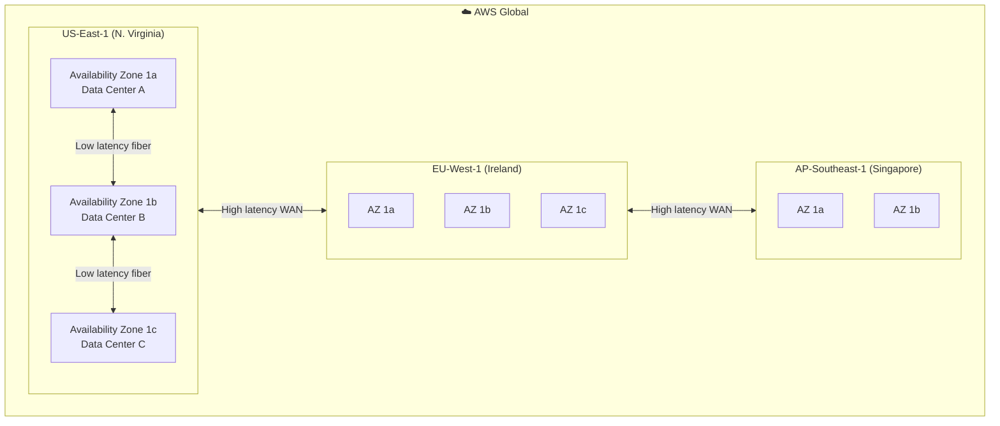
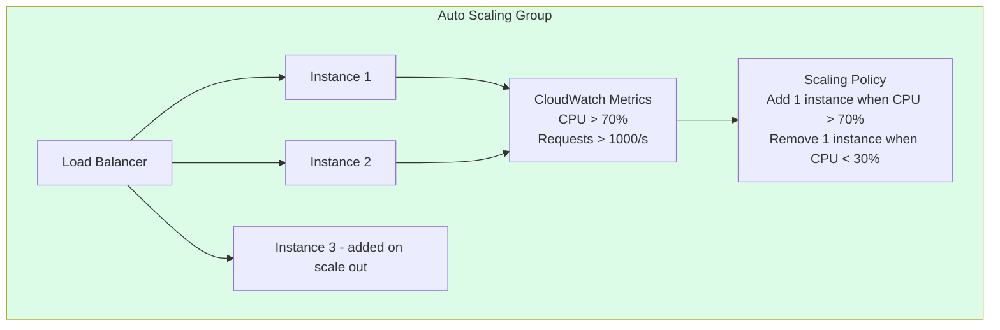
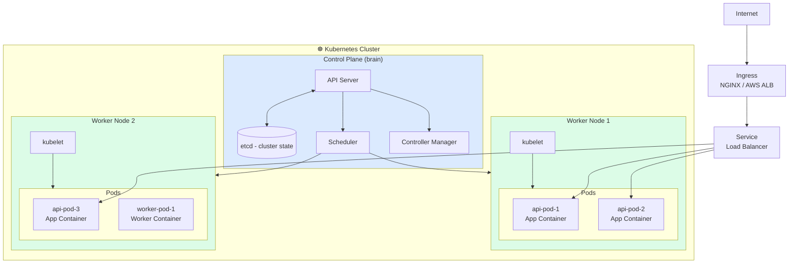
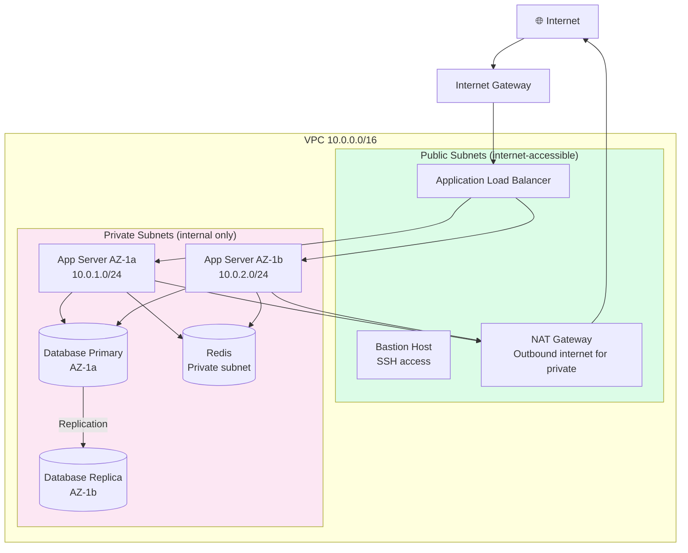
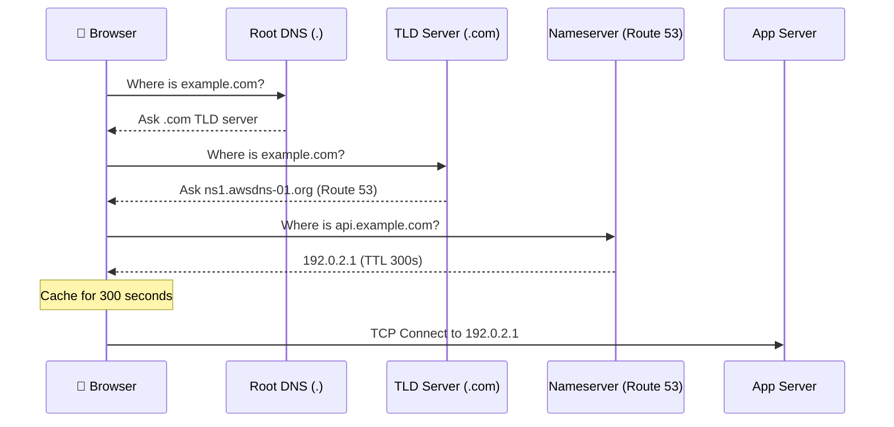
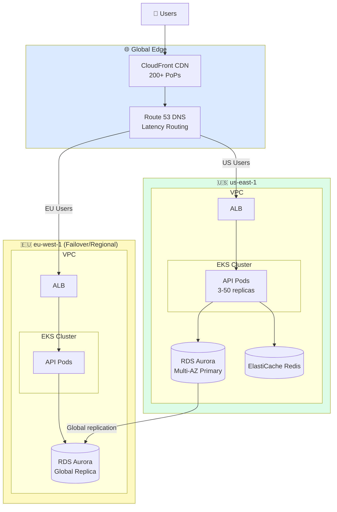

# Layer 6: Cloud & Compute
## The Infrastructure That Powers Everything

> **Layer role:** Cloud infrastructure is the foundation on which all other layers run. It provides virtual machines, networking, storage, managed databases, container orchestration, and global distribution. Understanding cloud architecture is what separates junior engineers from senior ones.

---

## Table of Contents

1. [Beginner Explanation](#beginner-explanation)
2. [Cloud Service Models](#cloud-service-models)
3. [Regions & Availability Zones](#regions--availability-zones)
4. [Virtual Machines & Compute](#virtual-machines--compute)
5. [Kubernetes](#kubernetes)
6. [Serverless Compute](#serverless-compute)
7. [Networking](#networking-vpc-subnets-security-groups)
8. [DNS & Domain Management](#dns--domain-management)
9. [Cloud Provider Comparison](#cloud-provider-comparison)
10. [Architecture Diagram](#architecture-diagram)
11. [Common Mistakes](#common-mistakes)
12. [Best Practices](#best-practices)
13. [Interview-Level Insights](#interview-level-insights)
14. [Summary](#summary)
15. [Production Checklist](#production-checklist)

---

## Beginner Explanation

"The cloud" is just other people's computers — data centers full of servers that you can rent by the hour. Instead of buying a physical server (expensive, slow to provision, you own it forever), you spin up a virtual machine in seconds, use it, then delete it.

The cloud also provides managed services: databases, message queues, load balancers, DNS, CDNs. Instead of running Redis yourself, you use AWS ElastiCache. Instead of configuring Nginx, you use AWS ALB. You pay more but operate less.

---

## Cloud Service Models

```
IaaS — Infrastructure as a Service
  You get: raw VMs, networks, storage
  You manage: OS, runtime, middleware, app, data
  Examples: AWS EC2, Google Compute Engine, Azure VMs

PaaS — Platform as a Service
  You get: managed runtime environment
  You manage: app, data
  Examples: Heroku, Google App Engine, AWS Elastic Beanstalk

SaaS — Software as a Service
  You get: ready-to-use software
  You manage: nothing
  Examples: Salesforce, Gmail, Slack

FaaS — Function as a Service (Serverless)
  You get: execution environment per function invocation
  You manage: function code, IAM permissions
  Examples: AWS Lambda, Google Cloud Functions, Vercel Functions
```

---

## Regions & Availability Zones



**Key concepts:**

```
Region:
  - Geographic area (us-east-1, eu-west-2, ap-southeast-1)
  - 30+ regions worldwide (AWS)
  - Choose based on: user location, data residency laws, service availability

Availability Zone (AZ):
  - Physically separate data center within a region
  - Separate power, cooling, networking
  - Connected by low-latency fiber (<2ms)
  - Deploy across 2-3 AZs for high availability

Multi-AZ deployment:
  - Database primary in AZ1, replica in AZ2
  - If AZ1 has a fire/power outage → failover to AZ2 in ~60s
  - This is the minimum for production
  - AWS RDS Multi-AZ does this automatically

Multi-Region deployment:
  - Active in US-East AND EU-West simultaneously
  - Users routed to nearest region (via Route 53 geolocation)
  - Data must be replicated globally (complex, expensive)
  - Required for: <50ms latency globally, global compliance, maximum HA
```

---

## Virtual Machines & Compute

### EC2 Instance Types (AWS)

```
Family    Example     vCPUs   RAM     Use Case
──────────────────────────────────────────────────────────
t4g       t4g.medium    2     4GB     Dev, test, burstable
c7g       c7g.2xlarge   8     16GB    Compute-intensive (encoding, gaming)
m7g       m7g.4xlarge  16     64GB    General purpose (most web apps)
r7g       r7g.2xlarge   8     64GB    Memory-intensive (in-memory DB, cache)
p4d       p4d.24xlarge 96    1.1TB    ML training (8x A100 GPUs)
```

### Auto Scaling



```yaml
# AWS Auto Scaling configuration
AutoScalingGroup:
  MinSize: 2          # Always at least 2 (one per AZ for HA)
  MaxSize: 20         # Budget limit
  DesiredCapacity: 3  # Normal operation

ScaleOutPolicy:
  MetricType: ALBRequestCountPerTarget
  TargetValue: 1000   # Scale out when avg > 1000 req/s per instance
  ScaleOutCooldown: 60s  # Wait 60s before scaling out again

ScaleInPolicy:
  MetricType: ALBRequestCountPerTarget
  TargetValue: 1000
  ScaleInCooldown: 300s  # Wait 5min before scaling in (prevent thrashing)
```

---

## Kubernetes

Kubernetes (K8s) is the standard for container orchestration at scale. It manages deploying, scaling, and operating containerized applications.



### Core Kubernetes Objects

```yaml
# Deployment — manages a set of identical pods
apiVersion: apps/v1
kind: Deployment
metadata:
  name: api
  namespace: production
spec:
  replicas: 3                    # Run 3 copies
  selector:
    matchLabels:
      app: api
  strategy:
    type: RollingUpdate
    rollingUpdate:
      maxSurge: 1                # Add 1 extra during update
      maxUnavailable: 0          # Never remove existing before new is ready
  template:
    metadata:
      labels:
        app: api
    spec:
      containers:
        - name: api
          image: 123456789.dkr.ecr.us-east-1.amazonaws.com/api:v1.2.3
          ports:
            - containerPort: 3000
          env:
            - name: DATABASE_URL
              valueFrom:
                secretKeyRef:
                  name: api-secrets
                  key: database-url
          resources:
            requests:            # Guaranteed resources
              memory: "256Mi"
              cpu: "250m"
            limits:              # Maximum resources
              memory: "512Mi"
              cpu: "500m"
          readinessProbe:        # Traffic only sent when ready
            httpGet:
              path: /health
              port: 3000
            initialDelaySeconds: 10
            periodSeconds: 5
          livenessProbe:         # Restart if unhealthy
            httpGet:
              path: /health
              port: 3000
            initialDelaySeconds: 30
            periodSeconds: 10
            failureThreshold: 3

---
# HorizontalPodAutoscaler — scale based on metrics
apiVersion: autoscaling/v2
kind: HorizontalPodAutoscaler
metadata:
  name: api-hpa
spec:
  scaleTargetRef:
    apiVersion: apps/v1
    kind: Deployment
    name: api
  minReplicas: 3
  maxReplicas: 50
  metrics:
    - type: Resource
      resource:
        name: cpu
        target:
          type: Utilization
          averageUtilization: 70
    - type: Resource
      resource:
        name: memory
        target:
          type: Utilization
          averageUtilization: 80

---
# Service — stable network endpoint for pods
apiVersion: v1
kind: Service
metadata:
  name: api-service
spec:
  selector:
    app: api
  ports:
    - port: 80
      targetPort: 3000
  type: ClusterIP  # Internal only; use LoadBalancer for external

---
# Ingress — HTTP routing with TLS termination
apiVersion: networking.k8s.io/v1
kind: Ingress
metadata:
  name: api-ingress
  annotations:
    kubernetes.io/ingress.class: "alb"
    alb.ingress.kubernetes.io/scheme: internet-facing
    alb.ingress.kubernetes.io/certificate-arn: arn:aws:acm:...
spec:
  rules:
    - host: api.example.com
      http:
        paths:
          - path: /
            pathType: Prefix
            backend:
              service:
                name: api-service
                port:
                  number: 80
```

---

## Networking: VPC, Subnets, Security Groups



**Security Groups (stateful firewall):**
```
ALB Security Group:
  Inbound:  80/tcp from 0.0.0.0/0 (HTTP)
  Inbound:  443/tcp from 0.0.0.0/0 (HTTPS)
  Outbound: 3000/tcp to App Security Group

App Security Group:
  Inbound:  3000/tcp from ALB Security Group only
  Outbound: 5432/tcp to DB Security Group
  Outbound: 6379/tcp to Redis Security Group
  Outbound: 443/tcp to 0.0.0.0/0 (HTTPS — for external APIs)

DB Security Group:
  Inbound:  5432/tcp from App Security Group only
  Outbound: (none needed)
```

---

## DNS & Domain Management



**AWS Route 53 Routing Policies:**

```
Simple:      api.example.com → 192.0.2.1
             One record, one destination

Weighted:    api.example.com → 192.0.2.1 (weight: 90)
             api.example.com → 192.0.2.2 (weight: 10)
             Used for: canary deployments, A/B testing

Latency:     api.example.com → us-east-1 server (for US users)
             api.example.com → eu-west-1 server (for EU users)
             Automatically routes to lowest latency region

Failover:    api.example.com → Primary (health check: healthy)
             api.example.com → Secondary (health check: failover)
             Auto-switches if primary fails health check

Geolocation: api.example.com → EU server (for requests from EU)
             api.example.com → US server (for requests from US)
             Used for: GDPR data residency, localized content
```

---

## Cloud Provider Comparison

| Service Category | AWS | Google Cloud | Azure |
|-----------------|-----|--------------|-------|
| **Compute** | EC2 | Compute Engine | Azure VMs |
| **Containers** | EKS | GKE | AKS |
| **Serverless** | Lambda | Cloud Functions | Azure Functions |
| **Object Storage** | S3 | Cloud Storage | Blob Storage |
| **Relational DB** | RDS / Aurora | Cloud SQL | Azure SQL |
| **NoSQL DB** | DynamoDB | Firestore / Bigtable | Cosmos DB |
| **Cache** | ElastiCache | Memorystore | Azure Cache |
| **CDN** | CloudFront | Cloud CDN | Azure CDN |
| **DNS** | Route 53 | Cloud DNS | Azure DNS |
| **Monitoring** | CloudWatch | Cloud Monitoring | Azure Monitor |
| **Market Share** | ~33% | ~11% | ~22% |
| **Strengths** | Broadest services, most mature | ML/Data, pricing, K8s | Enterprise, Windows, Office365 |

**Recommendation:** AWS has the broadest service catalog and most job market demand. GCP is excellent for ML workloads and has the best Kubernetes (GKE). Azure is essential if your company uses Microsoft products.

---

## Architecture Diagram



---

## Common Mistakes

### 1. No Multi-AZ Deployment
```yaml
# ❌ All instances in one AZ — single data center failure = full outage
subnets: [subnet-us-east-1a]

# ✅ Spread across AZs — one DC fails, others absorb traffic
subnets: [subnet-us-east-1a, subnet-us-east-1b, subnet-us-east-1c]
```

### 2. Overly Permissive Security Groups
```
# ❌ Database accessible from anywhere
DB Security Group Inbound: 5432/tcp from 0.0.0.0/0

# ✅ Database only accessible from app servers
DB Security Group Inbound: 5432/tcp from sg-app-servers
```

### 3. Missing Resource Limits in Kubernetes
```yaml
# ❌ One pod can consume all node memory, killing other pods (OOM)
resources: {}  # No limits

# ✅ Always set requests and limits
resources:
  requests:
    memory: "256Mi"
    cpu: "250m"
  limits:
    memory: "512Mi"
    cpu: "1000m"
```

---

## Best Practices

1. **Principle of least privilege** — IAM roles grant minimum permissions needed. No wildcard `*` in production policies.
2. **Tag all resources** — `Environment: production`, `Team: backend`, `CostCenter: API` — enables cost tracking and auditing.
3. **Use managed services where possible** — RDS vs running your own PostgreSQL: RDS is more expensive but handles backups, failover, patching.
4. **Infrastructure as Code** — All cloud resources defined in Terraform/Pulumi. Zero manual click-ops.
5. **Enable VPC Flow Logs** — Network-level audit trail, essential for security incident investigation.

---

## Interview-Level Insights

### Q: What is the difference between horizontal and vertical scaling?

**A:** Vertical scaling (scale up) means making a single server bigger — more CPU, more RAM. It's simple but has limits (biggest instance type) and creates a single point of failure.

Horizontal scaling (scale out) means adding more servers. It's theoretically unlimited and eliminates SPOF. But it requires stateless apps (no server-local state — use Redis/DB for state), a load balancer to distribute traffic, and distributed session management.

Modern production systems scale horizontally. Design for it from day one: keep API servers stateless, use Redis for sessions, use shared databases for state.

### Q: Explain the difference between a region and an AZ.

**A:** A region is a geographic location — `us-east-1` is Northern Virginia, `eu-west-2` is London. Each region is completely independent — it has its own power grid, network backbone, and data centers.

An AZ is a specific data center (or cluster of data centers) within a region. AZs within a region are physically separate (different buildings, sometimes different campuses) but connected by low-latency fiber. Multi-AZ deployment means your app survives a single data center failure. Multi-region means it survives a regional disaster.

---

## Summary

Cloud infrastructure is the foundation everything else runs on. Key principles:

1. **Multi-AZ by default** — Always deploy across availability zones
2. **Networking security** — Private subnets, tight security groups, no direct DB access from internet
3. **Infrastructure as Code** — Terraform or Pulumi, everything in git
4. **Managed services** — Pay for operations savings with higher unit cost
5. **Kubernetes for scale** — Declarative, self-healing, auto-scaling container orchestration

---

## Production Checklist

- [ ] Multi-AZ deployment (minimum 2 AZs)
- [ ] Private subnets for databases and app servers
- [ ] Security groups following least-privilege
- [ ] No public IP on database instances
- [ ] VPC Flow Logs enabled
- [ ] CloudTrail enabled (API audit logs)
- [ ] All resources tagged (team, environment, cost center)
- [ ] Infrastructure defined in Terraform/Pulumi (no click-ops)
- [ ] IAM roles with minimal permissions (no wildcard actions)
- [ ] Auto-scaling configured with appropriate min/max
- [ ] K8s resource requests and limits on all pods
- [ ] K8s readiness and liveness probes configured
- [ ] DNS TTL set appropriately (300s for most records)

---

*Previous: [Layer 5: Hosting →](../05-hosting/README.md) | Next: [Layer 7: CI/CD →](../07-cicd/README.md)*
