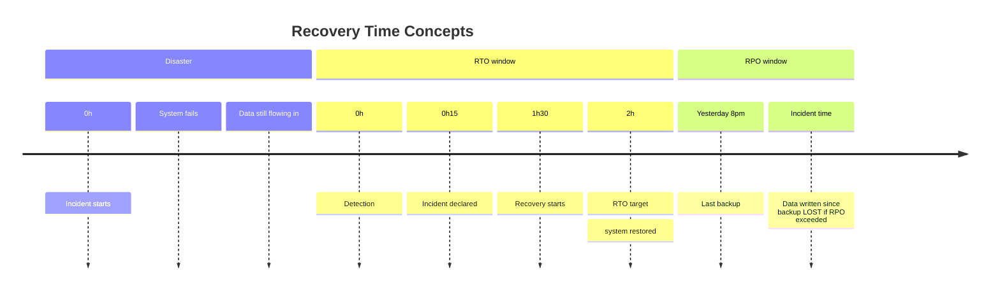
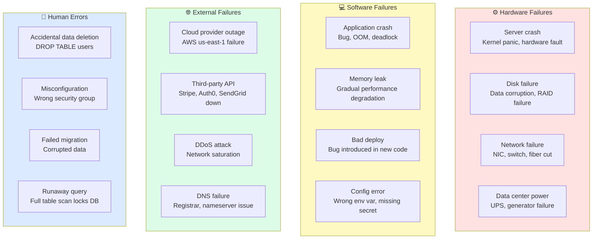
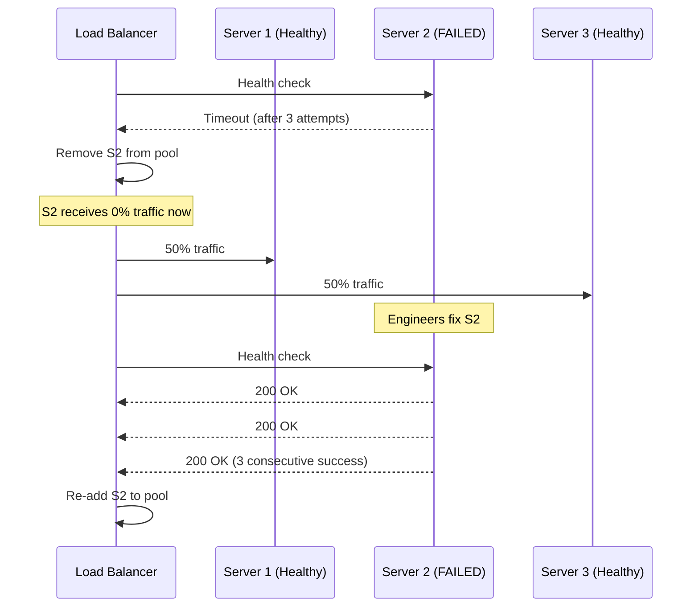
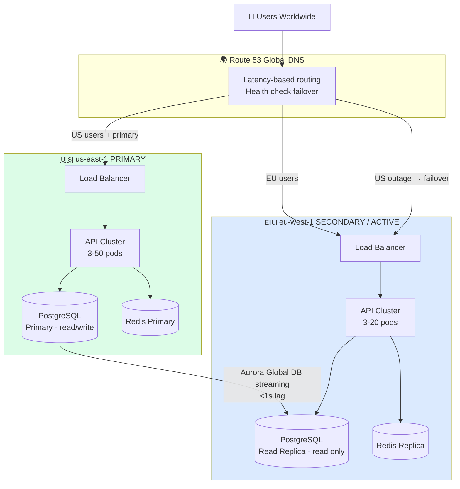
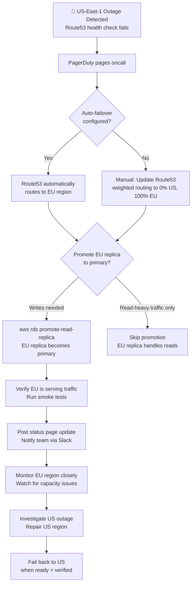
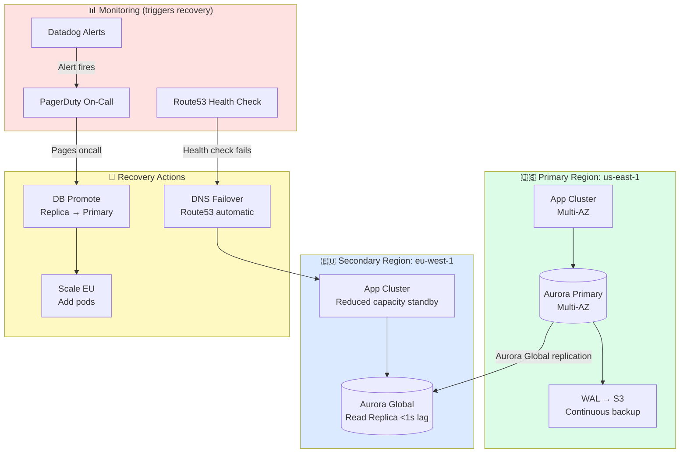

# Layer 13: Availability & Recovery
## Building Systems That Survive Failure

> **Layer role:** High availability and disaster recovery ensure your system keeps running — or recovers quickly — when components fail. At scale, failure is not an exception, it's an expectation. This layer is about designing systems that treat failure as a normal operating condition.

---

## Table of Contents

1. [Beginner Explanation](#beginner-explanation)
2. [Availability Fundamentals](#availability-fundamentals)
3. [RTO and RPO](#rto-and-rpo)
4. [Failure Modes](#failure-modes)
5. [High Availability Patterns](#high-availability-patterns)
6. [Multi-Region Deployment](#multi-region-deployment)
7. [Database Failover](#database-failover)
8. [Backup Strategies](#backup-strategies)
9. [Chaos Engineering](#chaos-engineering)
10. [Disaster Recovery Runbook](#disaster-recovery-runbook)
11. [Architecture Diagram](#architecture-diagram)
12. [Common Mistakes](#common-mistakes)
13. [Best Practices](#best-practices)
14. [Interview-Level Insights](#interview-level-insights)
15. [Summary](#summary)
16. [Production Checklist](#production-checklist)

---

## Beginner Explanation

Airlines don't hope their planes won't fail — they design for failure. Every critical system has redundancy: two engines, two pilots, backup hydraulics, emergency landing gear. When one system fails, a backup takes over automatically.

Production software is the same. Servers will crash. Disks will fail. Networks will partition. Entire data centers will go dark. A well-designed system handles these failures automatically, with users noticing nothing more than a brief slowdown.

The goal isn't to prevent all failures — it's to design systems where failures don't become outages.

---

## Availability Fundamentals

```
Availability = (Total Time - Downtime) / Total Time × 100%

What the "nines" actually mean:

99%    = 87.6 hours downtime/year    (1.7 hours/week)
99.9%  = 8.76 hours downtime/year   (10 min/week)     "three nines"
99.95% = 4.38 hours downtime/year   (5 min/week)
99.99% = 52.6 minutes downtime/year (1 min/week)      "four nines"
99.999%=  5.26 minutes downtime/year                  "five nines"

Most SaaS apps target: 99.9% → 99.99%
AWS offers: 99.99% for most services
Banking/Healthcare: 99.999%+ required
```

### What Determines Your Availability?

```
Your availability = product of all component availabilities

If component A has 99.9% uptime, and B has 99.9%, and they're sequential:
Combined: 99.9% × 99.9% = 99.8%  (worse than either alone!)

This is why redundancy matters:
Component A with hot standby:
  P(both fail) = (1 - 0.999) × (1 - 0.999) = 0.000001 = 99.9999% availability

More components = more failure modes
Redundancy transforms serial failures into parallel failures
```

---

## RTO and RPO

These are the two most important metrics in disaster recovery planning.



```
RTO — Recovery Time Objective
  How quickly must the system be restored?
  "Our RTO is 4 hours" → System must be back online within 4 hours of failure
  
  Factors:
  - How long to detect the failure (monitoring helps)
  - How long to failover (automated is faster)
  - How long to validate and announce recovery

RPO — Recovery Point Objective
  How much data loss is acceptable?
  "Our RPO is 1 hour" → We accept losing up to 1 hour of data
  
  Implementation:
  RPO = 0 (no data loss)     → Synchronous replication, streaming backup
  RPO = 1 hour               → Hourly backups + WAL archiving
  RPO = 24 hours             → Daily backups
```

### Setting RTO/RPO by System Criticality

| System | Example | RTO | RPO |
|--------|---------|-----|-----|
| **Payment processing** | Stripe, checkout | < 5 minutes | 0 (no data loss) |
| **Core product** | Main app, API | < 30 minutes | < 5 minutes |
| **Internal tools** | Admin dashboard | < 4 hours | < 1 hour |
| **Analytics** | Reporting, dashboards | < 24 hours | < 24 hours |
| **Dev/test** | Development env | < 48 hours | None (rebuild from code) |

---

## Failure Modes



---

## High Availability Patterns

### 1. Redundancy

```
Active-Active: All instances serve traffic simultaneously
  → Best availability, no failover delay
  → Requires stateless architecture
  → Load balancer distributes traffic
  → Example: API servers, web servers

Active-Passive: One primary serves, one standby waits
  → Failover time: 10s-60s (auto-detection + switchover)
  → Common for databases (primary + hot standby)
  → Example: PostgreSQL primary/replica
  
Hot Standby:  Standby running, ready to take over in seconds
Warm Standby: Standby running but needs data sync (minutes)
Cold Standby: Standby not running, must start and restore (hours)
```

### 2. Health Checks + Automatic Failover



### 3. Circuit Breaker

```typescript
import CircuitBreaker from 'opossum'

// Wrap external service calls in circuit breakers
const stripeCircuit = new CircuitBreaker(callStripeAPI, {
  timeout: 3000,                    // Request must complete in 3s
  errorThresholdPercentage: 50,     // Trip if 50%+ of calls fail
  resetTimeout: 30000,              // Try again after 30s
  volumeThreshold: 10,              // Need 10 calls before evaluating
})

// Fallback: what to do when circuit is open
stripeCircuit.fallback(async (chargeData) => {
  // Queue the charge for retry, return optimistic success
  await chargeQueue.add(chargeData, { delay: 30000 })
  return {
    status: 'queued',
    message: 'Payment processor temporarily unavailable. Will retry.',
    chargeId: generateOptimisticId(),
  }
})

stripeCircuit.on('open', () => {
  logger.error('Stripe circuit breaker OPEN — all payments queued')
  sentry.captureMessage('Stripe circuit breaker opened', 'error')
  metrics.increment('circuit_breaker.open', { service: 'stripe' })
})

stripeCircuit.on('halfOpen', () => {
  logger.info('Stripe circuit breaker testing...')
})

stripeCircuit.on('close', () => {
  logger.info('Stripe circuit breaker CLOSED — payments resuming')
})
```

---

## Multi-Region Deployment



### Failover Procedure



---

## Database Failover

```yaml
# AWS RDS Multi-AZ — automatic failover (60-120s typical)
# Synchronous replication to standby in different AZ
resource "aws_db_instance" "production" {
  identifier     = "production-postgres"
  engine         = "postgres"
  engine_version = "16.1"
  instance_class = "db.r7g.2xlarge"

  multi_az = true  # Standby in different AZ, auto-failover

  deletion_protection = true  # Can't accidentally delete

  backup_retention_period = 30   # 30 days of automated backups
  backup_window           = "03:00-04:00"

  # Metrics to trigger alarm
  monitoring_interval = 60
}

# Aurora Global Database — cross-region failover (<1 minute)
resource "aws_rds_global_cluster" "global" {
  global_cluster_identifier = "global-production"
  engine                    = "aurora-postgresql"
  engine_version            = "16.1"
  deletion_protection       = true
}

# Primary cluster (us-east-1)
resource "aws_rds_cluster" "primary" {
  global_cluster_identifier = aws_rds_global_cluster.global.id
  # ... configuration
}

# Secondary cluster (eu-west-1) — read-only, can be promoted
resource "aws_rds_cluster" "secondary" {
  global_cluster_identifier = aws_rds_global_cluster.global.id
  # Typically <1 second behind primary
  # Promote to primary on disaster: aws rds failover-global-cluster
}
```

---

## Backup Strategies

```
3-2-1 Backup Rule:
  3 copies of data
  2 different storage media
  1 copy offsite

For a SaaS app:
  Copy 1: Live production database
  Copy 2: Multi-AZ standby (same region, different AZ)
  Copy 3: Daily snapshot to S3 in different region (+ WAL archiving)
```

```bash
# PostgreSQL backup strategy using pgBackRest

# Configure WAL archiving (continuous backup — RPO near zero)
archive_mode = on
archive_command = 'pgbackrest --stanza=prod archive-push %p'
archive_timeout = 60  # Archive WAL segment at least every 60 seconds

# Daily full backup (3am)
# cron: 0 3 * * *
pgbackrest --stanza=prod --type=full backup

# Hourly incremental backup
# cron: 0 * * * *
pgbackrest --stanza=prod --type=incr backup

# Verify backup is valid (test restore)
# cron: 0 4 * * 0 (Sunday)
pgbackrest --stanza=prod --type=time \
  --target="$(date -u +%Y-%m-%d)T04:00:00Z" \
  --target-action=promote \
  restore

# Point-in-Time Recovery to specific timestamp
pgbackrest --stanza=prod --type=time \
  --target="2024-01-15 14:30:00 UTC" \
  --target-action=promote \
  restore
```

---

## Chaos Engineering

Netflix invented the practice of intentionally injecting failures in production to verify your system handles them.

```
Chaos Monkey → Randomly terminates EC2 instances in production
Chaos Kong  → Simulates entire AWS region failure
Latency Monkey → Introduces random latency between services
Chaos Gorilla → Simulates full availability zone failure

Why do this?
- Every production incident is a chaos experiment you didn't control
- Better to find weaknesses with the whole team available than at 3am
- Builds muscle memory for incident response
- Proves your monitoring and alerting actually works
```

```typescript
// Chaos engineering toolkit (Gremlin / AWS Fault Injection Simulator)
// Or build simple chaos:

// Randomly return 500 errors (5% of requests) to test frontend resilience
if (process.env.CHAOS_MODE === 'true' && Math.random() < 0.05) {
  throw new Error('[CHAOS] Random failure injected')
}

// Introduce random latency to test timeout handling
if (process.env.CHAOS_LATENCY_MS) {
  await new Promise(resolve =>
    setTimeout(resolve, parseInt(process.env.CHAOS_LATENCY_MS))
  )
}

// AWS Fault Injection Simulator — enterprise chaos engineering
const fis = new FISClient({ region: 'us-east-1' })
await fis.send(new StartExperimentCommand({
  experimentTemplateId: 'EXT123',
  // Experiment: terminate 25% of API pods for 5 minutes
  // Verify: error rate stays below 1%, latency stays below 500ms
}))
```

---

## Disaster Recovery Runbook

```markdown
# Disaster Recovery Runbook
## Scenario: Full Primary Region Failure

### Detection
- Alert: Route53 health check failure for us-east-1
- Alert: All API health checks failing
- Duration trigger: > 2 minutes

### Impact Assessment
- [ ] Check AWS Status Page: status.aws.amazon.com
- [ ] Check Datadog: is it a full region failure or partial?
- [ ] Estimate affected users (check EU traffic vs US traffic ratio)

### Decision Tree
IF us-east-1 is fully down AND expected recovery > 30 minutes:
  → Execute failover to eu-west-1

IF partial degradation AND recovery < 30 minutes:
  → Monitor, scale EU to handle additional load, wait

### Failover Steps (estimated time: 15 minutes)
1. [2min] Notify team in #incident Slack channel
2. [2min] Update status page (statuspage.io): "Investigating service disruption"
3. [5min] Fail over DNS:
   aws route53 change-resource-record-sets \
     --hosted-zone-id Z123 \
     --change-batch file://failover-to-eu.json
4. [5min] Promote EU read replica if writes needed:
   aws rds failover-global-cluster \
     --global-cluster-identifier global-production \
     --target-db-cluster-identifier arn:aws:rds:eu-west-1:123456789:cluster:production-eu
5. [3min] Scale EU app cluster:
   kubectl scale deployment/api --replicas=20 -n production
6. [2min] Verify: smoke tests pass against eu endpoint
7. Update status page: "Service restored, investigating root cause"

### Post-Failover Monitoring
- Watch EU error rate (should be < 0.5%)
- Watch EU latency (US users will see +50ms — expected)
- Watch EU database connections (scaled up but limits still apply)
- Alert if EU auto-scaling isn't keeping up

### Fail Back (after US recovery)
1. Verify US region is stable (run for 30 minutes without alerts)
2. Sync any writes from EU back to US replica
3. Gradually shift traffic: 10% → 50% → 90% → 100% over 30 minutes
4. Demote EU back to read replica
5. Update status page: "All systems normal"

### Post-Mortem (within 48 hours)
1. Timeline of events (exact timestamps)
2. Root cause (5 whys)
3. What we detected correctly / missed
4. What worked well in the response
5. Action items: prevent recurrence, improve response
```

---

## Architecture Diagram



---

## Common Mistakes

### 1. Untested Backups
```bash
# ❌ Never tested backup restores
# Running backups for 2 years, never tested
# Disaster hits → try to restore → backup is corrupted
# "We have backups" ≠ "We can restore from backups"

# ✅ Test restores regularly (monthly minimum)
# Restore to isolated environment, verify data integrity
pgbackrest restore --stanza=prod --recovery-option="recovery_target_time=2024-01-15 10:00:00"
# Verify: compare row counts, spot check data
# Document: time it took, any issues found
```

### 2. No Status Page
```
# ❌ During outage: 1000 users flood support email asking what's wrong
# Support team overwhelmed, can't investigate while answering emails

# ✅ Status page (statuspage.io, Atlassian, Cachet):
# Users check status page → see "Investigating degraded performance"
# You update it every 15 minutes with progress
# Result: 80% fewer support tickets during incidents
```

### 3. Missing Cross-Region Dependency Check
```
# ❌ You fail over to eu-west-1 but forgot:
# - Auth service still only runs in us-east-1 → all logins fail
# - Email service (SendGrid) webhooks go to us-east-1 URL → lost
# - Stripe webhooks go to us-east-1 → payment confirmations lost
# - Background jobs write to us-east-1 database → data in two places

# ✅ Dependency mapping:
# For every service, document: which external dependencies are regional?
# Run quarterly cross-region failover drill → discover gaps before disasters
```

---

## Best Practices

1. **Design for failure** — Assume every component will fail. Ask: "What breaks if this dies?"
2. **Automate recovery** — Manual failover at 3am with a sleepy oncall is slow and error-prone.
3. **Test your DR plan** — Run a failover drill quarterly. Find the gaps before incidents do.
4. **Define RPO/RTO for every system** — These drive your architecture decisions and cost.
5. **Practice blameless post-mortems** — The goal is system improvement, not finding scapegoats.

---

## Interview-Level Insights

### Q: What is the difference between HA and DR?

**A:** High Availability (HA) is about eliminating single points of failure to prevent unplanned downtime. It's always-on redundancy: multiple servers, multi-AZ databases, load balancers. HA keeps the system running through component failures without human intervention.

Disaster Recovery (DR) is the plan for recovering from catastrophic failures — entire region down, data corrupted, all redundancy failed simultaneously. DR involves procedures, documented runbooks, tested restore processes, and defined RTO/RPO targets.

HA prevents most outages. DR handles the outages that HA can't prevent.

### Q: What is chaos engineering and why do companies practice it?

**A:** Chaos engineering is the practice of intentionally injecting failures into production systems to discover weaknesses before they cause uncontrolled incidents.

Netflix created Chaos Monkey to terminate random EC2 instances in production. Their philosophy: "Every production failure is chaos engineering you didn't choose." By running controlled experiments, they:
1. Discover weaknesses when engineers are alert and prepared
2. Build resilience into systems by knowing what actually happens (not what should happen)
3. Build operational muscle memory for incident response
4. Verify that monitoring and alerting actually works

The prerequisite is good observability — you can't run chaos experiments without knowing if they caused problems.

---

## Summary

Availability and recovery are the final layer — the safety net beneath everything else. Key principles:

1. **Redundancy eliminates single points of failure** — Multi-AZ minimum, multi-region for critical systems
2. **Automate failover** — Manual procedures during an outage add chaos
3. **Define RTO/RPO before disaster** — Drives architecture and cost decisions
4. **Test your backups** — An untested backup is a false promise
5. **Practice the runbook** — Chaos engineering and DR drills reveal gaps safely

With all 13 layers working together, you have a system that is: secure against attacks, fast for users, reliable through failures, observable for operations, and deployable with confidence.

---

## Production Checklist

- [ ] Multi-AZ for all stateful services (database, Redis)
- [ ] Database automated backups enabled (30-day retention minimum)
- [ ] Backup restore tested quarterly (documented procedure)
- [ ] Point-in-time recovery configured (WAL archiving)
- [ ] RTO/RPO defined for each service tier
- [ ] DR runbook documented and accessible
- [ ] Route53 health checks configured for automatic DNS failover
- [ ] Status page configured (statuspage.io or equivalent)
- [ ] On-call rotation with clear escalation path
- [ ] Secondary region standing by (warm standby minimum)
- [ ] Circuit breakers on all external service calls
- [ ] Graceful degradation: what works when dependencies fail?
- [ ] Chaos engineering experiments scheduled quarterly
- [ ] Post-mortem template defined
- [ ] Blameless post-mortems practiced

---

*Previous: [Layer 12: Monitoring →](../12-monitoring/README.md) | Return to: [Main Index →](../index.md)*

---

# You've Completed All 13 Layers

Congratulations. You now have a complete mental model of how production software systems work — from the user's browser click to the database and back, across thirteen distinct architectural layers.

The engineers who build and operate systems like Instagram, Netflix, Stripe, and GitHub are not operating from a different playbook. They understand exactly what you've just learned — and apply it systematically, at scale, with discipline.

**What comes next:**
- [Learning Roadmap](../learning-roadmap.md) — Structured path from beginner to senior
- [Production Architecture Examples](../production-architecture-examples.md) — Complete system designs for real apps
- [Glossary](../glossary.md) — Every term defined
