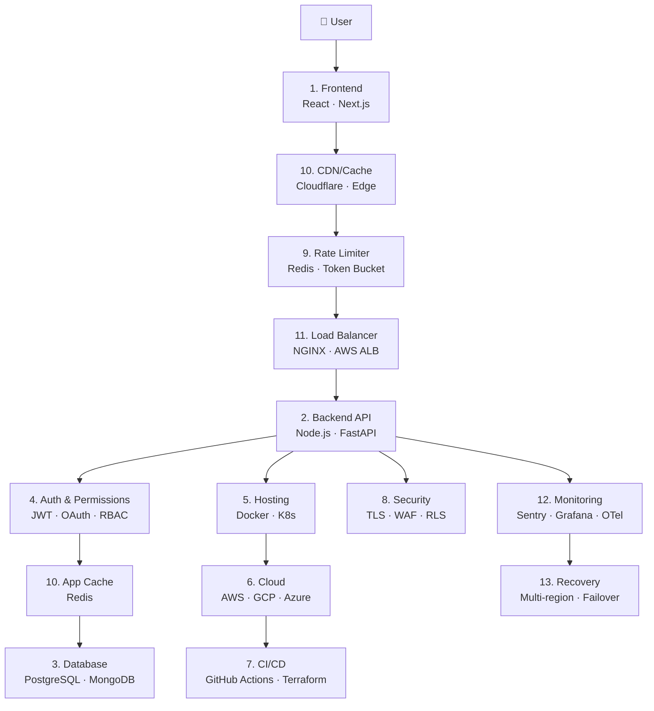
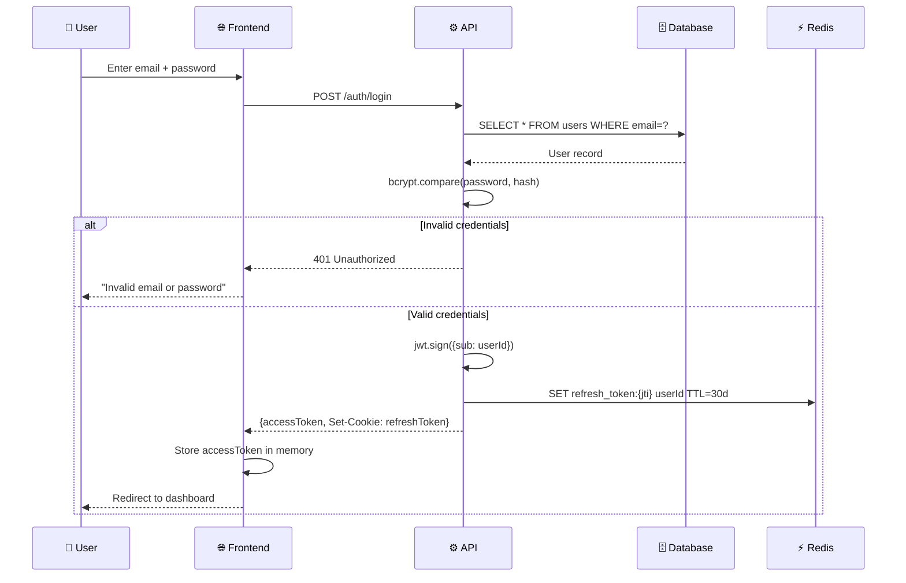
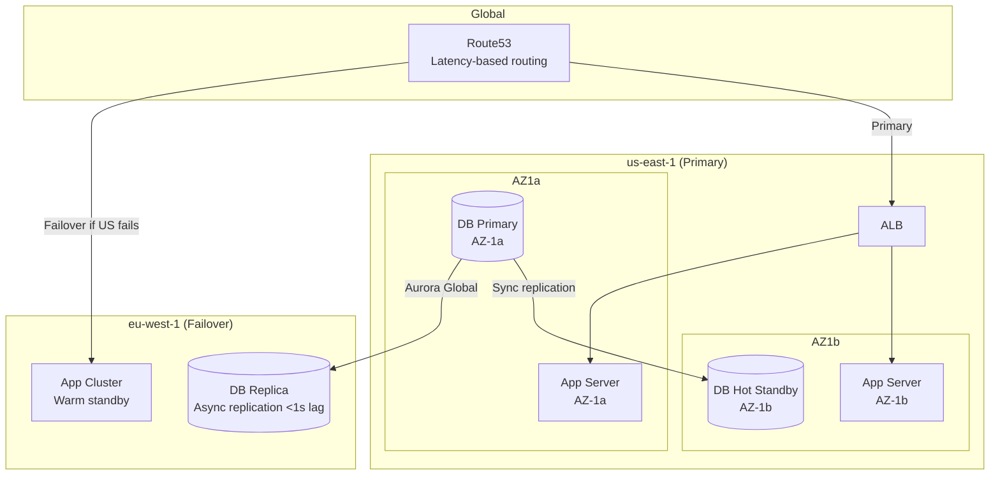
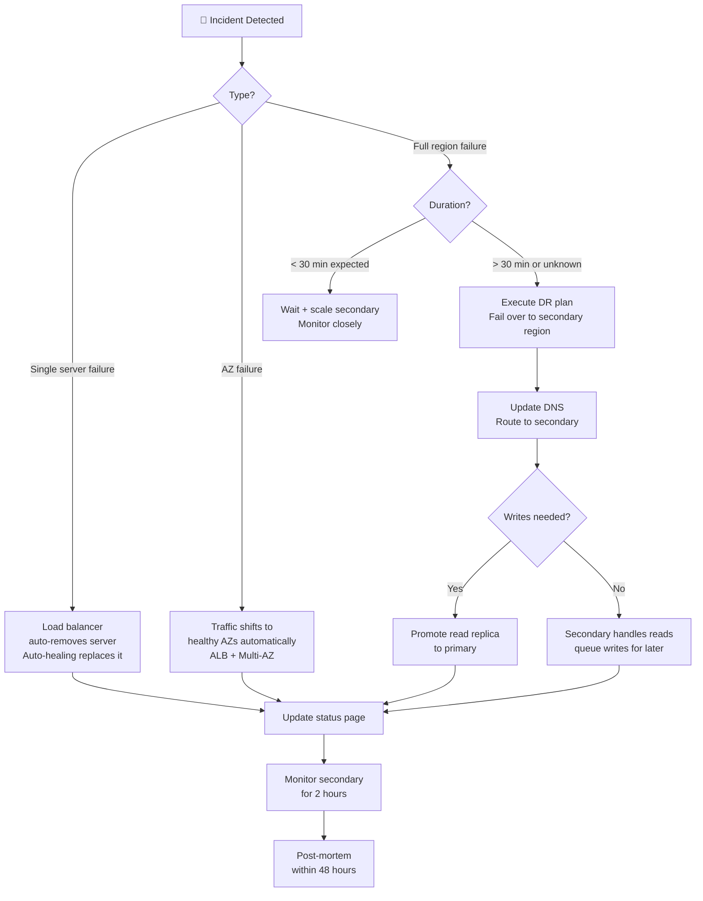

# Architecture Diagrams
## All Visual Assets in One Place

> This directory collects every major architecture diagram from the guide for quick reference. Use these for system design interviews, technical presentations, and architecture reviews.

---

## 1. Complete 13-Layer System Architecture



---

## 2. Request Lifecycle (Complete)

```
👤 User clicks button
    │
    ▼ (1ms)
🌐 Browser cache check
  └─ HIT: return cached response immediately
  └─ MISS: continue ↓
    │
    ▼ (5-20ms)
🌍 CDN Edge Node (nearest PoP)
  └─ HIT: return cached page/asset
  └─ MISS: forward to origin ↓
    │
    ▼
🚦 Rate Limiter
  └─ BLOCKED: return 429 Too Many Requests
  └─ ALLOWED: continue ↓
    │
    ▼
⚖️ Load Balancer
  └─ Route to least-loaded healthy server
    │
    ▼
📋 Middleware Pipeline
  ├─ Request logger (correlation ID attached)
  ├─ CORS check
  ├─ Auth (validate JWT / session)
  └─ Input validation
    │
    ▼
⚙️ Business Logic (Service Layer)
  ├─ Apply business rules
  ├─ Check authorization (RBAC/ABAC)
  └─ Orchestrate data access
    │
    ▼
⚡ Cache Check (Redis)
  └─ HIT: return cached data
  └─ MISS: query database ↓
    │
    ▼
🗄️ Database
  ├─ Writes: Primary (ACID transaction)
  └─ Reads: Read Replica
    │
    ▼ (cache backfill on miss)
⚡ Cache Write (Redis, with TTL)
    │
    ▼
📊 Observability
  ├─ Emit metrics (Prometheus)
  ├─ Write structured log (Loki)
  └─ End trace span (Jaeger/Tempo)
    │
    ▼
👤 Response returned to user (~150ms total)
```

---

## 3. Authentication Flow



---

## 4. CI/CD Pipeline

```mermaid
flowchart LR
    DEV[👩‍💻 Developer\npushes code] --> TRIGGER[GitHub Actions\ntriggered]

    subgraph Pipeline
        LINT[Lint + TypeCheck\n~1 min]
        TEST[Tests\n~3 min]
        SECURITY[Security Scan\n~2 min]
        BUILD[Docker Build\n~4 min]
        SCAN[Image Scan\n~2 min]

        LINT --> TEST
        TEST --> SECURITY
        SECURITY --> BUILD
        BUILD --> SCAN
    end

    TRIGGER --> LINT
    SCAN --> STAGE[🟡 Deploy Staging\n~2 min]
    STAGE --> SMOKE[Smoke Tests\n~3 min]
    SMOKE --> APPROVE{Manual\nApproval?}
    APPROVE -->|Approved| PROD[🟢 Deploy Production\nCanary 5%]
    PROD --> MONITOR[Monitor 15 min]
    MONITOR -->|Healthy| FULL[100% traffic]
    MONITOR -->|Issues| ROLLBACK[🔄 Rollback]
```



---

## 5. Caching Architecture

```
Latency by cache level:

L1: Browser Memory (React state)    ─── 0ms
    │
L2: Browser HTTP Cache (disk)       ─── 0ms
    │
L3: CDN Edge (nearest PoP)          ─── 5-20ms
    │ Cache miss
    ▼
L4: Application Cache (Redis)       ─── 1ms
    │ Cache miss
    ▼
L5: Database Read Replica           ─── 5-15ms
    │ Read replica miss
    ▼
L6: Database Primary                ─── 10-50ms

TTL Strategy:
  Static assets (hashed filenames): 365 days (immutable)
  HTML pages:                        no-cache (revalidate)
  API: public data (articles):       5-60 minutes
  API: user-specific data:           private, no CDN
  Redis: user profiles:              5 minutes
  Redis: sessions:                   30 minutes
  Redis: global config:              24 hours
```

---

## 6. Database Scaling Ladder

```
Step 1: Query Optimization (FREE)
  └─ Add indexes on foreign keys + filter columns
  └─ Fix N+1 queries with eager loading
  └─ Add covering indexes for hot queries
  └─ Expected improvement: 10-100x

Step 2: Connection Pooling (CHEAP)
  └─ Add PgBouncer in transaction mode
  └─ Expected improvement: 3-5x connection capacity

Step 3: Vertical Scale (SIMPLE)
  db.r7g.large → db.r7g.2xlarge → db.r7g.8xlarge
  └─ More RAM = more data in buffer pool = fewer disk reads
  └─ Cost: 2-4x per step

Step 4: Read Replicas (MODERATE)
  └─ Route all SELECT queries to replicas
  └─ Keep writes on primary
  └─ Add 1-3 replicas
  └─ Expected improvement: 3-4x read throughput

Step 5: Partitioning (ADVANCED)
  └─ Partition large tables by time or range
  └─ Query planner skips irrelevant partitions
  └─ Old partitions can be archived cheaply

Step 6: Sharding (LAST RESORT)
  └─ Split data across multiple DB servers
  └─ Very complex cross-shard queries
  └─ Only when all above options exhausted
```

---

## 7. Security Defense in Depth

```
Layer 1: DNS / Edge (Cloudflare)
  ├─ DDoS mitigation (absorbs Tbps attacks)
  ├─ IP reputation blocking
  ├─ Geo-blocking
  └─ Bot detection

Layer 2: Network (VPC/Security Groups)
  ├─ DB only accessible from app servers
  ├─ No public IPs on backend resources
  └─ VPC Flow Logs for audit trail

Layer 3: TLS/HTTPS
  ├─ All traffic encrypted in transit
  ├─ TLS 1.3 minimum
  └─ HSTS preload

Layer 4: Web Application Firewall (WAF)
  ├─ SQL injection patterns blocked
  ├─ XSS patterns blocked
  └─ OWASP Core Rule Set

Layer 5: Application (API)
  ├─ JWT validation on every request
  ├─ Input validation (Zod)
  ├─ Security headers (CSP, X-Frame-Options)
  └─ CSRF protection (SameSite cookies)

Layer 6: Data (Database)
  ├─ Row-Level Security (RLS)
  ├─ Parameterized queries
  ├─ Encryption at rest (AES-256)
  └─ Minimal DB user permissions

Layer 7: Secrets
  ├─ AWS Secrets Manager (rotated)
  ├─ No secrets in code or env files
  └─ Audit log for secret access
```

---

## 8. High Availability Architecture



---

## 9. Monitoring Stack

```
Application Instrumentation
  ├─ Logs (Pino → Loki)
  │    └─ JSON structured, correlation ID on every line
  ├─ Metrics (Prometheus → Grafana)
  │    ├─ http_requests_total (counter)
  │    ├─ http_request_duration_seconds (histogram)
  │    └─ active_connections (gauge)
  └─ Traces (OpenTelemetry → Tempo/Jaeger)
       └─ Full request journey across services

Error Tracking (Sentry)
  └─ Exceptions captured with stack trace + user context

Alerting Rules (AlertManager)
  ├─ Error rate > 1% for 2 minutes → PAGE oncall (P1)
  ├─ p95 latency > 500ms for 5 minutes → notify team (P2)
  ├─ DB connections > 80% → warn (P3)
  └─ Certificate expiring < 30 days → warn (P3)

On-Call Flow:
  Alert → PagerDuty → Engineer's phone
  Engineer → #incident channel → investigate
  → Mitigate (rollback/flag) → Post-mortem
```

---

## 10. Disaster Recovery Decision Tree



---

*Back to [Index →](../index.md)*
