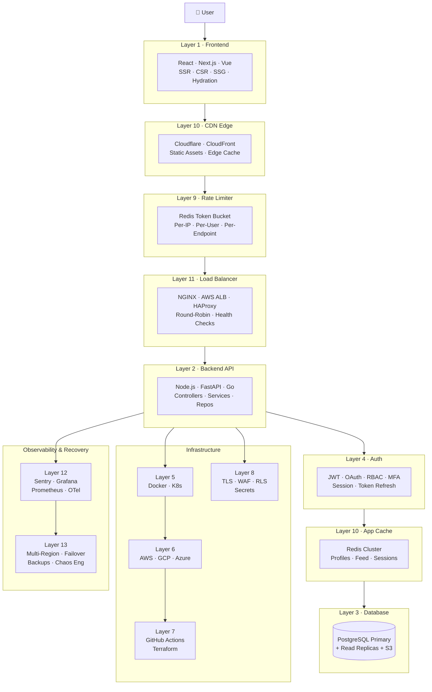

# Global System Architecture Diagram
## Standalone Reference

```mermaid
graph TB
    subgraph Layer1["Layer 1 · Frontend"]
        FE[React · Next.js · Vue\nSSR · CSR · SSG · Hydration]
    end

    subgraph Layer10a["Layer 10 · CDN Edge"]
        CDN[Cloudflare · CloudFront\nStatic Assets · Edge Cache]
    end

    subgraph Layer9["Layer 9 · Rate Limiter"]
        RL[Redis Token Bucket\nPer-IP · Per-User · Per-Endpoint]
    end

    subgraph Layer11["Layer 11 · Load Balancer"]
        LB[NGINX · AWS ALB · HAProxy\nRound-Robin · Health Checks]
    end

    subgraph Layer2["Layer 2 · Backend API"]
        API[Node.js · FastAPI · Go\nControllers · Services · Repos]
    end

    subgraph Layer4["Layer 4 · Auth"]
        AUTH[JWT · OAuth · RBAC · MFA\nSession · Token Refresh]
    end

    subgraph Layer10b["Layer 10 · App Cache"]
        REDIS[Redis Cluster\nProfiles · Feed · Sessions]
    end

    subgraph Layer3["Layer 3 · Database"]
        DB[(PostgreSQL Primary\n+ Read Replicas + S3)]
    end

    subgraph InfraRow["Infrastructure"]
        HOST[Layer 5\nDocker · K8s]
        CLOUD[Layer 6\nAWS · GCP · Azure]
        CICD[Layer 7\nGitHub Actions\nTerraform]
        SEC[Layer 8\nTLS · WAF · RLS\nSecrets]
    end

    subgraph ObsRow["Observability & Recovery"]
        MON[Layer 12\nSentry · Grafana\nPrometheus · OTel]
        REC[Layer 13\nMulti-Region · Failover\nBackups · Chaos Eng]
    end

    USER[👤 User] --> Layer1
    Layer1 --> Layer10a --> Layer9 --> Layer11 --> Layer2
    Layer2 --> Layer4 --> Layer10b --> Layer3
    Layer2 --> HOST --> CLOUD --> CICD
    Layer2 --> SEC
    Layer2 --> MON --> REC
```
