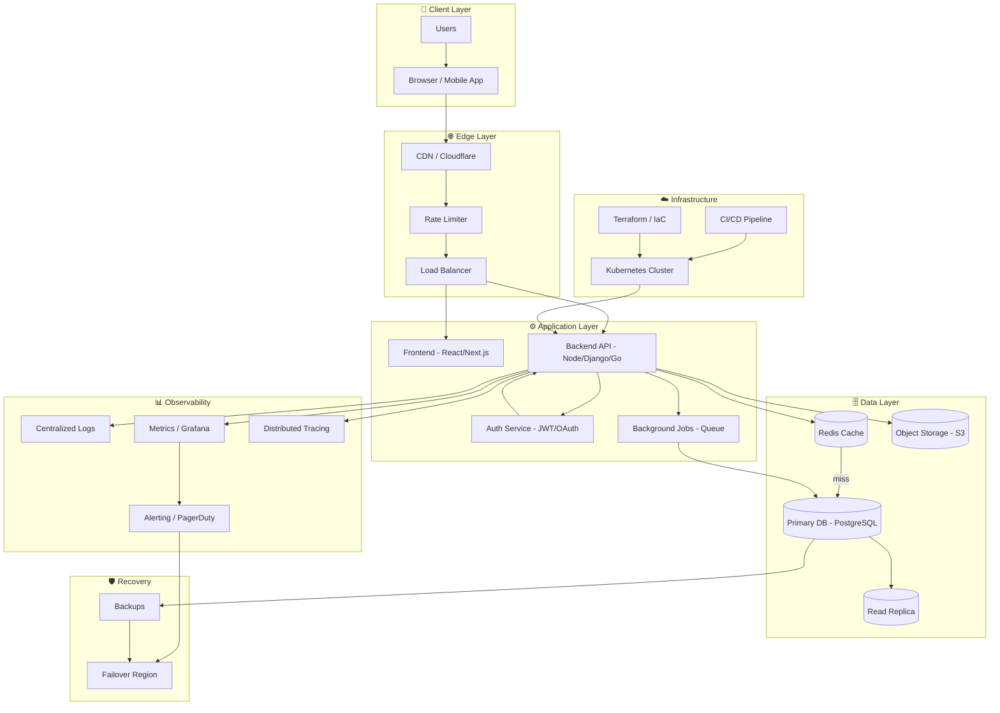
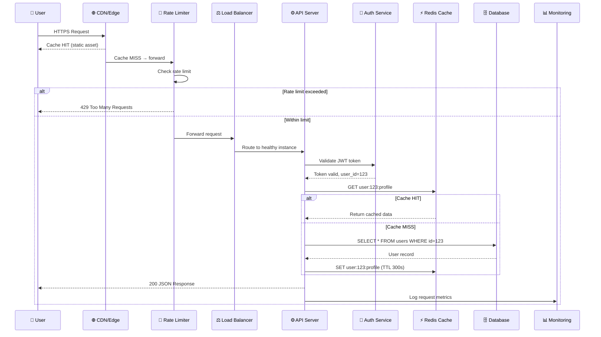

# The 13 Layers of Modern Full-Stack Architecture
## A Complete Software Engineering Handbook

> **Who this is for:** Developers at any level who want to understand how production systems really work — from the browser to the database to disaster recovery. This guide covers every layer, every tradeoff, every pattern you need to build, scale, and maintain real applications.

---

## What You Will Learn

This handbook walks you through the 13 architectural layers that make up every serious production application — the same layers powering Instagram, Netflix, Uber, ChatGPT, YouTube, and Amazon.

By the end you will understand:
- How a user's browser click travels through 13 distinct layers before data comes back
- Why Netflix can serve 250 million users without going down
- How Stripe processes millions of payments without losing a single transaction
- What actually happens during a deploy — and how to roll back when it breaks
- How to design systems that survive hardware failure, traffic spikes, and security attacks

---

## Global System Architecture

```
┌─────────────────────────────────────────────────────────────────────┐
│                          USERS (BILLIONS)                           │
│              Browser · Mobile App · Desktop App · API Client        │
└──────────────────────────────┬──────────────────────────────────────┘
                               │ HTTPS Request
┌──────────────────────────────▼──────────────────────────────────────┐
│              LAYER 1 · FRONTEND                                     │
│        React · Next.js · Vue · Angular · Tailwind CSS               │
│       SSR · CSR · SSG · Hydration · State Management                │
└──────────────────────────────┬──────────────────────────────────────┘
                               │ API Call (REST / GraphQL / WebSocket)
┌──────────────────────────────▼──────────────────────────────────────┐
│              LAYER 10 · CDN & CACHING (Edge)                        │
│          Cloudflare · Fastly · AWS CloudFront · Akamai              │
│               Static Assets · Edge Cache · TLS Termination          │
└──────────────────────────────┬──────────────────────────────────────┘
                               │ Cache Miss → Origin
┌──────────────────────────────▼──────────────────────────────────────┐
│              LAYER 9 · RATE LIMITING                                │
│          Redis Token Bucket · Sliding Window · API Gateway          │
│             Per-User Quotas · DDoS Protection · Throttling          │
└──────────────────────────────┬──────────────────────────────────────┘
                               │ Allowed Request
┌──────────────────────────────▼──────────────────────────────────────┐
│              LAYER 11 · LOAD BALANCER                               │
│           NGINX · HAProxy · AWS ALB · Round-Robin · L7              │
│             Health Checks · SSL Termination · Routing               │
└──────────────────────────────┬──────────────────────────────────────┘
                               │ Distributed to healthy instance
┌──────────────────────────────▼──────────────────────────────────────┐
│              LAYER 2 · BACKEND / API                                │
│    Node.js · NestJS · FastAPI · Django · Spring Boot · Go           │
│    Controllers · Services · Middleware · Background Jobs            │
└──────────────────────────────┬──────────────────────────────────────┘
                               │ Verify Identity
┌──────────────────────────────▼──────────────────────────────────────┐
│              LAYER 4 · AUTH & PERMISSIONS                           │
│         JWT · OAuth2 · Sessions · RBAC · ABAC · MFA · SSO          │
│           Token Validation · Policy Enforcement · Audit Logs        │
└──────────────────────────────┬──────────────────────────────────────┘
                               │ Authorized — fetch/write data
┌──────────────────────────────▼──────────────────────────────────────┐
│              LAYER 10 · CACHE (In-Process / Redis)                  │
│     Redis · Memcached · In-Memory · Query Cache · Object Cache      │
└──────────────────────────────┬──────────────────────────────────────┘
                               │ Cache miss → Query DB
┌──────────────────────────────▼──────────────────────────────────────┐
│              LAYER 3 · DATABASE & STORAGE                           │
│  PostgreSQL · MySQL · MongoDB · Redis · Cassandra · S3 · Blob       │
│  ACID · Transactions · Indexing · Sharding · Replication            │
└──────────────────────────────┬──────────────────────────────────────┘
                               │
        ┌──────────────────────┼─────────────────────────┐
        │ Deployed by          │ Runs on                 │ Secured by
┌───────▼────────┐  ┌──────────▼──────────┐  ┌──────────▼─────────┐
│  LAYER 7       │  │   LAYER 5 & 6        │  │   LAYER 8          │
│  CI/CD         │  │   Hosting & Cloud    │  │   Security         │
│  GitHub Actions│  │   AWS · GCP · Azure  │  │   TLS · WAF        │
│  Terraform     │  │   K8s · Docker       │  │   Secrets · RLS    │
└────────────────┘  └─────────────────────┘  └────────────────────┘
        │                     │                          │
        └──────────────────────┼─────────────────────────┘
                               │ All layers observed by
┌──────────────────────────────▼──────────────────────────────────────┐
│              LAYER 12 · MONITORING & OBSERVABILITY                  │
│         Sentry · Datadog · Grafana · ELK · OpenTelemetry            │
│         Logs · Metrics · Traces · Alerts · Dashboards               │
└──────────────────────────────┬──────────────────────────────────────┘
                               │ Failure detected
┌──────────────────────────────▼──────────────────────────────────────┐
│              LAYER 13 · AVAILABILITY & RECOVERY                     │
│      Multi-Region · Failover · RTO/RPO · Backup · Chaos Engineering │
└─────────────────────────────────────────────────────────────────────┘
```

---

## Complete Mermaid System Diagram



---

## The 13 Layers — Quick Reference

| # | Layer | Purpose | Key Technologies |
|---|-------|---------|-----------------|
| 1 | [Frontend](./01-frontend/README.md) | User interface & experience | React, Next.js, Vue, Angular, Tailwind |
| 2 | [Backend / APIs](./02-backend/README.md) | Business logic & data processing | Node.js, NestJS, FastAPI, Django, Go |
| 3 | [Database & Storage](./03-database/README.md) | Persistent data & file storage | PostgreSQL, MongoDB, Redis, S3 |
| 4 | [Auth & Permissions](./04-auth/README.md) | Identity, access control | JWT, OAuth2, RBAC, SSO, MFA |
| 5 | [Hosting & Deployment](./05-hosting/README.md) | Where & how apps run | Vercel, AWS, Docker, Railway |
| 6 | [Cloud & Compute](./06-cloud/README.md) | Infrastructure & VMs | AWS, GCP, Azure, Kubernetes |
| 7 | [CI/CD & Version Control](./07-cicd/README.md) | Automated delivery pipelines | GitHub Actions, Terraform, Jenkins |
| 8 | [Security & RLS](./08-security/README.md) | Threat protection & access policies | TLS, WAF, RLS, Secrets, Zero Trust |
| 9 | [Rate Limiting](./09-rate-limiting/README.md) | API protection & abuse prevention | Redis, Cloudflare, API Gateways |
| 10 | [Caching & CDN](./10-caching/README.md) | Speed & latency reduction | Cloudflare, Redis, Fastly, Akamai |
| 11 | [Scaling & Load Balancing](./11-scaling/README.md) | Traffic distribution & elasticity | NGINX, HAProxy, AWS ELB, K8s HPA |
| 12 | [Monitoring & Logs](./12-monitoring/README.md) | Observability & incident detection | Sentry, Datadog, ELK, Grafana |
| 13 | [Availability & Recovery](./13-recovery/README.md) | Uptime, failover, disaster recovery | Multi-region, RTO/RPO, Chaos Eng. |

---

## Request Lifecycle (End-to-End)



---

## How to Use This Guide

### For Beginners
Start with the [Learning Roadmap](./learning-roadmap.md), then read layers 1 → 2 → 3 → 4 in order. Each layer builds on the previous. Don't skip ahead.

### For Intermediate Developers
You likely know layers 1-4. Focus on layers 5-8 (deployment, cloud, CI/CD, security) and layer 10-11 (caching and scaling). These are where most mid-level gaps exist.

### For Senior / System Design
Dive into layers 6, 11, 12, and 13. Read [Production Architecture Examples](./production-architecture-examples.md) for real-world system design patterns. Use the interview notes in each layer for FAANG preparation.

---

## Supporting Documents

| Document | Description |
|----------|-------------|
| [Learning Roadmap](./learning-roadmap.md) | Step-by-step skill progression from beginner to senior |
| [Production Architecture Examples](./production-architecture-examples.md) | Real architectures: SaaS, social media, AI, e-commerce |
| [Glossary](./glossary.md) | Definitions for every technical term used in this guide |
| [Diagrams](./diagrams/) | All Mermaid and ASCII architecture diagrams in one place |

---

## Key Principles This Guide Teaches

> **Principle 1 — Separation of Concerns**
> Every layer has a single responsibility. The frontend doesn't talk directly to the database. The database doesn't validate tokens. Layers communicate through well-defined interfaces.

> **Principle 2 — Defense in Depth**
> Security is not one layer. It's every layer. Rate limiting at the edge, auth at the API, RLS at the database — multiple layers mean multiple chances to stop an attack.

> **Principle 3 — Design for Failure**
> At scale, everything fails. Networks partition, disks fill up, services crash. Production systems assume failure and build recovery into the architecture.

> **Principle 4 — Observability Over Debugging**
> You cannot debug a distributed system by adding print statements. You need structured logs, distributed traces, and metrics dashboards before problems happen.

> **Principle 5 — Automate the Boring Stuff**
> Deployments, testing, infrastructure provisioning — anything done manually more than twice should be automated. CI/CD and IaC exist for exactly this reason.

---

*Start with [Layer 1: Frontend →](./01-frontend/README.md)*
