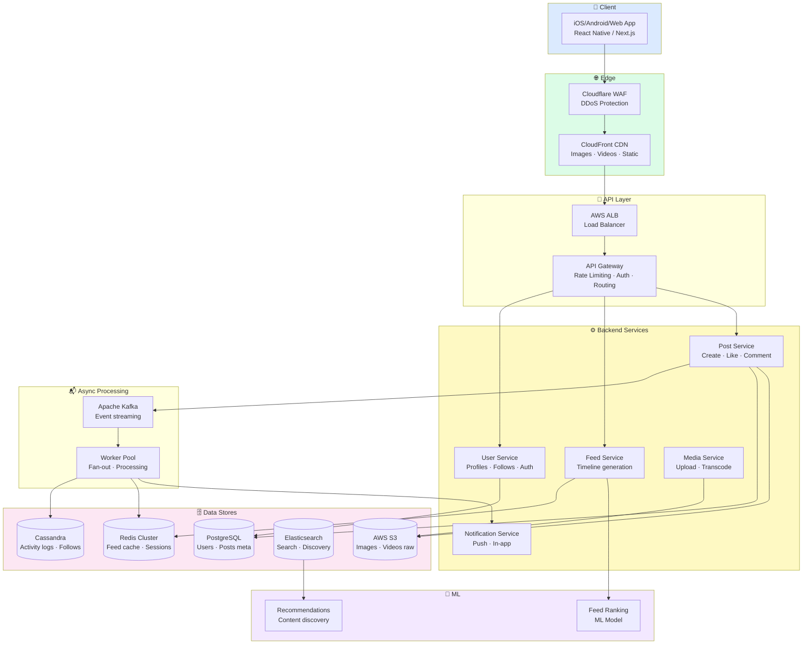
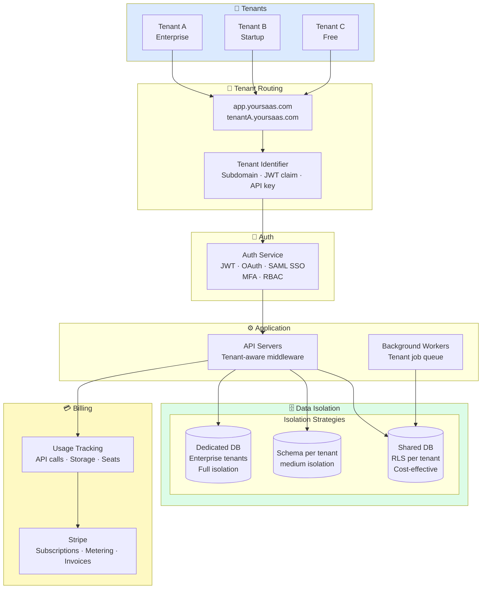
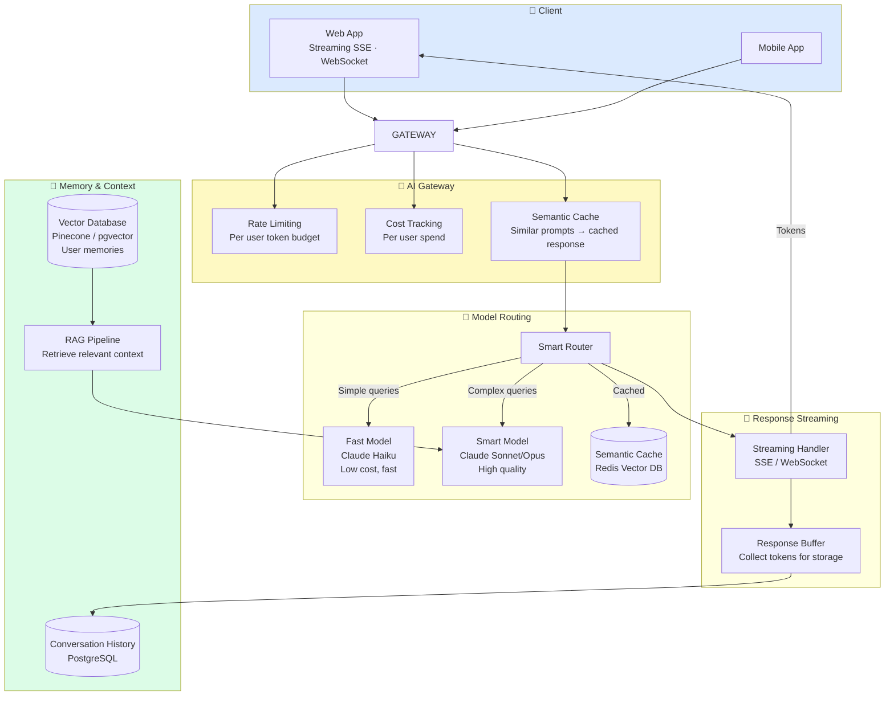
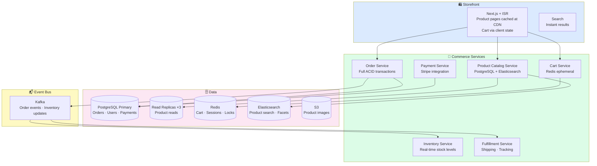
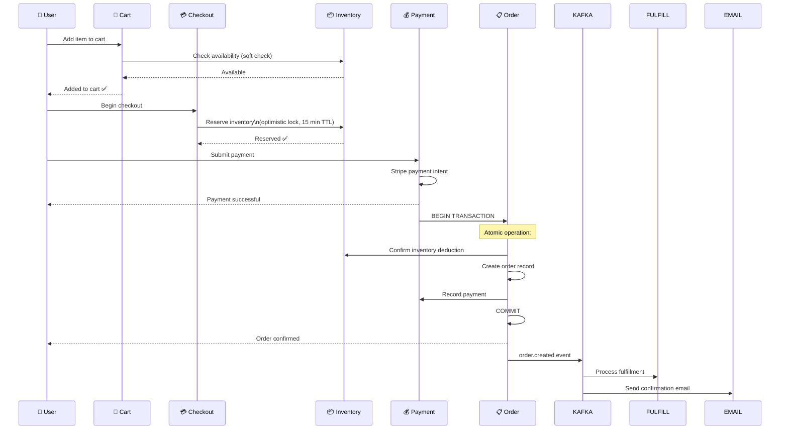

# Production Architecture Examples
## Real System Designs for Real Applications

> These architectures are battle-tested patterns used by production companies. They show how all 13 layers work together in specific real-world scenarios.

---

## 1. Social Media Platform (Instagram-scale)

### System Requirements

```
Scale: 100M+ daily active users
Core features: User feed, posts (images/video), likes, comments, follows, stories
Performance: Feed loads < 1s, images render < 500ms
Availability: 99.99% uptime
Consistency: Eventually consistent (slight lag in feed acceptable)
```

### Architecture



### Key Design Decisions

**Feed Architecture (Fan-out):**
```
When Alice (1M followers) posts a photo:

Option A: Fan-out on Write (push model)
  On post → write Alice's post to 1M follower timelines in Redis
  On read → instant (Redis lookup)
  Problem: Writing 1M Redis entries per celebrity post is slow/expensive

Option B: Fan-out on Read (pull model)
  On post → only write Alice's post to Alice's post store
  On read → fetch followed users' posts, merge, sort
  Problem: User follows 1000 accounts → 1000 DB queries per feed load

Instagram's hybrid approach:
  Regular users (< 10K followers): Fan-out on write
  Celebrity users (> 1M followers): Fan-out on read (pulled on demand)
  Redis stores the timeline (pre-computed list of post IDs)
```

**Media Processing Pipeline:**
```
1. User uploads via presigned S3 URL (mobile → S3 directly, no backend overhead)
2. S3 event trigger → SNS → Lambda → Media processing queue
3. Workers transcode video (4K → 1080p → 720p → 480p)
4. Workers generate image thumbnails (multiple sizes)
5. Output stored in S3 CDN bucket
6. CloudFront serves from edge (200+ PoPs globally)
7. Adaptive bitrate: video quality adjusts to connection speed
```

### Full Request Lifecycle: Loading the Instagram Feed

```
1. App opens → auth token read from secure storage
2. Request: GET https://api.instagram.com/v1/feed?limit=12
3. DNS: Route53 → nearest region load balancer
4. Cloudflare: rate limit check, DDoS scrubbing
5. ALB: route to available API server
6. API Gateway: JWT validation (verify signature, check expiry)
7. Feed Service: check Redis cache for user's timeline
8. Cache HIT: return pre-computed list of 12 post IDs
9. Batch fetch post metadata from PostgreSQL
10. Response returned to client: JSON with post data + media URLs
11. Client renders skeleton immediately
12. Images fetched lazily from CloudFront CDN
13. Total time: ~150ms (95th percentile)
```

---

## 2. SaaS Application (Multi-tenant)

### System Requirements

```
Scale: 50K business customers, millions of end users
Core features: Per-tenant data isolation, subscription billing, analytics, teams/roles
Performance: API < 200ms p95, dashboards < 2s
Compliance: SOC2, GDPR
Availability: 99.9% (downtime budget: 8.7 hours/year)
```

### Architecture



### Multi-Tenancy Patterns

```sql
-- Pattern 1: Shared database with tenant isolation via RLS (most common for SMB)
ALTER TABLE projects ENABLE ROW LEVEL SECURITY;

-- All data in one table, tenant_id column everywhere
CREATE TABLE projects (
  id          UUID PRIMARY KEY,
  tenant_id   UUID NOT NULL REFERENCES tenants(id),
  name        VARCHAR(200) NOT NULL,
  created_at  TIMESTAMPTZ DEFAULT NOW()
);

-- RLS ensures tenants never see each other's data
CREATE POLICY projects_tenant_isolation ON projects
  FOR ALL
  USING (tenant_id = current_setting('app.tenant_id')::uuid);

-- Application sets tenant context per request
await db.query(`SET LOCAL app.tenant_id = '${tenantId}'`)
```

```typescript
// Tenant middleware — identifies and validates tenant on every request
const tenantMiddleware = async (req, res, next) => {
  // Extract tenant from: subdomain, JWT, or API key header
  const tenantId = extractTenantId(req)

  // Validate tenant exists and subscription is active
  const tenant = await tenantCache.get(tenantId)
    ?? await tenantRepo.findActive(tenantId)

  if (!tenant) return res.status(401).json({ error: 'Invalid tenant' })
  if (tenant.suspended) return res.status(402).json({
    error: 'Account suspended',
    billingUrl: `https://app.yoursaas.com/${tenant.slug}/billing`
  })

  // Check plan limits
  if (!tenant.plan.canDoAction(req.path, req.method)) {
    return res.status(403).json({
      error: 'Feature not available on your plan',
      upgradeUrl: `https://app.yoursaas.com/${tenant.slug}/upgrade`
    })
  }

  req.tenant = tenant
  next()
}
```

---

## 3. AI Application (ChatGPT-scale)

### System Requirements

```
Scale: 100M+ users, millions of concurrent conversations
Core features: Streaming responses, conversation history, tool use, multimodal
Latency: First token < 1s, streaming tokens in real-time
Cost: LLM API calls are expensive — optimize aggressively
```

### Architecture



### Key AI Patterns

**Streaming Implementation:**
```typescript
// Server-Sent Events for streaming LLM responses
app.post('/chat', requireAuth, async (req, res) => {
  const { message, conversationId } = req.body

  // Set up streaming headers
  res.setHeader('Content-Type', 'text/event-stream')
  res.setHeader('Cache-Control', 'no-cache')
  res.setHeader('Connection', 'keep-alive')

  // Fetch conversation history for context
  const history = await conversationRepo.getHistory(conversationId, 20)

  // Retrieve relevant memories from vector DB
  const memories = await vectorDB.similarSearch(message, { userId: req.user.id, limit: 5 })

  // Stream from Claude API
  const stream = await anthropic.messages.stream({
    model: 'claude-sonnet-4-6',
    max_tokens: 2048,
    system: buildSystemPrompt(memories),
    messages: [...history, { role: 'user', content: message }],
  })

  let fullResponse = ''

  for await (const chunk of stream) {
    if (chunk.type === 'content_block_delta') {
      const token = chunk.delta.text
      fullResponse += token

      // Stream token to client
      res.write(`data: ${JSON.stringify({ token })}\n\n`)
    }
  }

  // Save complete conversation to DB
  await conversationRepo.addMessage(conversationId, {
    role: 'assistant',
    content: fullResponse,
    usage: await stream.finalUsage(),
  })

  // Track cost
  const usage = await stream.finalUsage()
  await usageTracker.record(req.user.id, {
    inputTokens: usage.input_tokens,
    outputTokens: usage.output_tokens,
    cost: calculateCost(usage, 'claude-sonnet-4-6'),
  })

  res.write(`data: [DONE]\n\n`)
  res.end()
})
```

**Prompt Caching (Anthropic API):**
```typescript
// Cache long system prompts to reduce cost and latency
// Claude API - prompt caching feature

const response = await anthropic.messages.create({
  model: 'claude-sonnet-4-6',
  max_tokens: 1024,
  system: [
    {
      type: 'text',
      text: LONG_SYSTEM_PROMPT,  // 1000+ tokens
      cache_control: { type: 'ephemeral' }  // Cache this for 5 minutes
      // First call: paid at full price
      // Subsequent calls within 5 min: 90% cheaper!
    }
  ],
  messages: [{ role: 'user', content: userMessage }],
})
```

---

## 4. E-Commerce Platform (Shopify-scale)

### System Requirements

```
Scale: Millions of products, thousands of merchants, peak: Black Friday
Core features: Product catalog, inventory, cart, checkout, payments, orders, fulfillment
Transactions: Must be ACID — no double-charging, no selling out-of-stock
Latency: Product pages < 500ms, checkout < 1s
Availability: 99.99% — downtime during checkout = direct revenue loss
```

### Architecture



### Checkout Flow (Critical Path)



**Inventory Locking (Preventing Overselling):**
```typescript
// Optimistic locking prevents selling more than available
async function reserveInventory(productId: string, quantity: number, ttlSeconds = 900) {
  const lockKey = `inventory:lock:${productId}`
  const reservationKey = `inventory:reserved:${productId}`

  // Lua script — atomic check and reserve
  const script = `
    local available = tonumber(redis.call('GET', KEYS[1])) or 0
    local requested = tonumber(ARGV[1])

    if available < requested then
      return 0  -- Not enough stock
    end

    redis.call('DECRBY', KEYS[1], requested)
    redis.call('SETEX', KEYS[2], ARGV[2], ARGV[1])
    return 1  -- Reserved successfully
  `

  const result = await redis.eval(
    script, 2,
    `inventory:available:${productId}`,
    `inventory:reserved:${productId}:${cartId}`,
    quantity, ttlSeconds
  )

  if (!result) throw new InsufficientInventoryError(`Insufficient stock for ${productId}`)
}
```

---

## Common Failure Modes & Solutions

### 1. Database Bottleneck

```
Symptom: DB CPU at 100%, queries timing out, reads slow
Causes:
  - Missing indexes on frequently queried columns
  - N+1 query pattern
  - Missing connection pooling
  - Too many simultaneous connections
  - Long-running transactions holding locks

Solutions (in order):
  1. Add missing indexes (check pg_stat_user_tables, slow query log)
  2. Fix N+1 with eager loading
  3. Add PgBouncer connection pooling
  4. Add read replicas for SELECT-heavy workloads
  5. Vertical scale (more RAM = more data in buffer pool)
```

### 2. Cache Stampede

```
Symptom: Brief thundering herd on cache expiry, DB spike every N minutes
Cause: Popular cache key expires, thousands of requests all miss and hit DB

Solution: Probabilistic early refresh
  if (remaining_ttl < threshold && random() < probability) {
    backgroundRefresh(key)  // One request refreshes in background
  }
  return stale_cached_value  // Others use stale data briefly
```

### 3. Deployment Failure

```
Symptom: Error rate spikes after new deployment
Detection: Alert fires within 2 minutes
Response:
  1. Immediate rollback (kubectl rollout undo / feature flag disable)
  2. Error rate should recover within 5 minutes
  3. Investigate in staging before re-deploying
  4. Post-mortem: why did tests not catch this?
```

### 4. Security Vulnerability Discovered

```
Scenario: Security researcher reports SQLi in /api/search endpoint

Immediate (< 1 hour):
  1. Disable endpoint or add WAF rule to block exploit pattern
  2. Review access logs: was it exploited? What data was accessed?
  3. If exploited: notify affected users, legal team, DPA within 72 hours (GDPR)

Short-term (< 1 week):
  1. Fix the vulnerability
  2. Add parameterized queries
  3. Add input validation
  4. Deploy fix

Long-term:
  1. Audit all similar code patterns
  2. Add automated security scanning to CI/CD
  3. Schedule penetration test
  4. Add SQLi to internal security training
```

---

## Scaling Journey: 0 to 10M Users

```
0 - 1K users: Single server + PostgreSQL
  Architecture: 1 server, 1 database, no Redis, no CDN
  Cost: $50-100/month (Railway, Render, DigitalOcean)
  Focus: Build the product, find product-market fit

1K - 10K users: Add reliability
  Architecture: 2 servers behind load balancer, managed database
  Add: CDN for static assets, Redis for sessions
  Cost: $200-500/month
  Focus: Uptime, basic monitoring

10K - 100K users: Add performance
  Architecture: Auto-scaling API servers, read replicas, queue workers
  Add: Database read replica, Redis cluster, job queue
  Cost: $1K-5K/month
  Focus: Performance, caching strategy

100K - 1M users: Add scalability
  Architecture: Kubernetes, microservice extraction (auth/notifications)
  Add: Elasticsearch for search, CDN for images, proper observability
  Cost: $10K-50K/month
  Focus: Reliability, team structure, observability

1M - 10M users: System design decisions matter
  Architecture: Multi-region, dedicated databases per domain
  Add: Global load balancing, chaos engineering, SRE practices
  Cost: $100K-$500K/month
  Focus: Global reliability, team scaling, cost optimization
```

---

*Back to [Index →](./index.md) | [Learning Roadmap →](./learning-roadmap.md) | [Glossary →](./glossary.md)*
